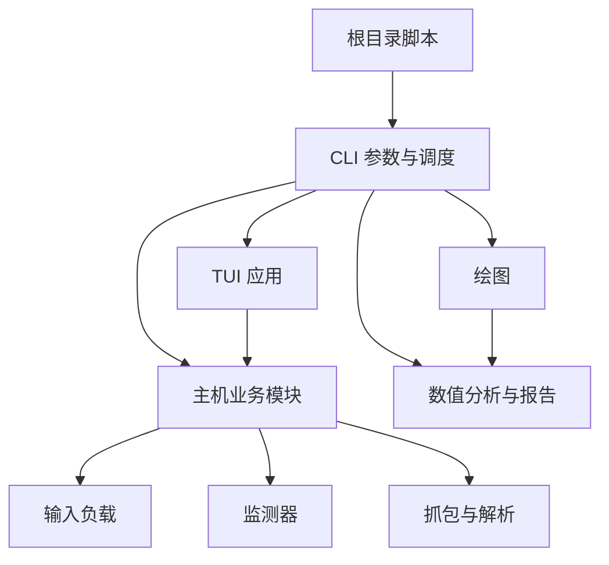

# AC-Prof 代码架构

AC-Prof 的命令入口负责参数和调度，业务模块按输入规划、运行时采集、结果分析与界面组织。
根目录脚本负责命令启动；Python 调用直接引用职责所属模块，不保留已被替代的导入入口。

`acprof/platform.py` 是环境识别和平台能力策略的唯一入口，保持标准库依赖；
`capabilities.py` 分开维护平台 support 与采集 evidence。`host/platform_metadata.py` 只在准备阶段
采集版本信息，analysis/plotting 只读取保存的环境身份，不探测当前主机来解释历史结果。
WSL2 PARTIAL 与 Native Linux FULL 的边界见 [WSL2](platforms/wsl2.md)。

安装包通过 `acprof.cli.main` 惰性分发 `acprof <command>`，根脚本继续调用同一实现。
`installation.py` 区分只读构建资源和用户工作目录，并生成 Python/standalone 子进程命令。
资源、安装与发布边界见[发行包说明](Distribution.md)。

修改模块边界、依赖方向或兼容入口时查阅本文。操作说明见 [中文 README](i18n/README_zh-CN.md#项目结构与开发)，
字段与测量口径见 [指标与结果分析](Metrics.md#result_allcsv-字段解释)，运行环境扩展见[模型运行环境与适配器](Runtime_Compatibility.md)。

- [目录与职责](#目录与职责)：先定位实现模块。
- [入口与依赖方向](#入口与依赖方向)：检查导入关系和兼容边界。
- [主机编排与测量](#主机编排与测量)：追踪输入规划、镜像、采集窗口及 profiler。
- [结果分析与补采](#结果分析与补采)：定位 CSV 消费、拟合及补采写入。
- [TUI 与兼容维护](#tui-与兼容维护)：检查界面拆分、mock 位置和验证范围。

## 目录与职责

| 位置 | 职责 |
| --- | --- |
| `acprof/cli/` | 命令参数、入口调度和退出处理 |
| `acprof/tui/` | Textual 页面、事件、命令构造、进度、设置和日志控件 |
| `acprof/analysis/` | 延迟模型的数值计算、验证与报告文件 |
| `acprof/plotting/` | 当前 CSV 校验、图表配置、颜色与渲染 |
| `acprof/host/` | 模型检测、环境预检、输入计划、容器与采集编排、profiler |
| `acprof/host/posthoc/` | 已有结果的 profiler 补采、回填、备份与回滚 |
| `acprof/container/` | 容器内模型下载、HTTP server、推理处理器和 profiler runner |
| `acprof/workloads/` | 各任务族的确定性输入与素材准备 |
| `acprof/monitors/` | 能耗、资源与 PMU 的原始测量 |
| `acprof/packet/` | 抓包解析及 packet latency 合并 |
| `acprof/config.py` | 共享配置、任务尺度及 CSV/静态元数据字段协议 |
| `acprof/artifacts.py`、`acprof/result_csv.py` | 原子产物发布、CSV 结构与测量唯一键校验；不初始化采集依赖 |
| `acprof/artifact_layout.py` | 结果清单、v2/flat 布局识别、受限相对路径及 case sidecar 路由；采集、恢复、补采和分析共用 |
| `acprof/pixel_metrics.py` | 像素计数和能耗/延迟归一化的纯计算，由 client、packet 和 plotting 共用 |
| `acprof/runtime_profiles.py` | 平台、依赖环境、逻辑 profile 与锁身份；从扩展声明读取路由 |
| `acprof/model_resolution.py`、`acprof/model_spec.py` | 静态接口候选、schema 校验与执行契约；本地／作者声明优先于自动生成 |
| `acprof/model_evidence.py`、`acprof/model_metadata_analysis.py`、`acprof/model_source_analysis.py`、`acprof/model_contract.py` | 固定 snapshot 的来源记录、结构化元数据、受限 AST 与 Pipeline 契约生成；仅在主机准备阶段分析文本，细节见[自动生成模型契约](Runtime_Compatibility.md#自动生成模型契约m1m6) |
| `acprof/model_dependencies.py`、`acprof/model_review.py`、`acprof/model_transforms.py` | 按 loader 角色固定依赖与文件选择、未决字段的显式决策、有界 JSON 输入转换；下载复用既有镜像 planner |
| `acprof/host/model_inspection.py`、`acprof/container/model_probe.py`、`acprof/tui/model_resolution.py` | CLI／TUI 的解释和契约审阅、隔离 basic 导入／签名检查；full 复用 `runtime_validation`，所有 Probe 在正式测量前结束 |
| `acprof/host/automation.py`、`acprof/host/model_coverage.py` | 精确模型的访问／能力预检、自动运行报告，以及固定样本的解析／运行覆盖率；`cli/auto.py` 委派现有 run 入口，不复制测量循环 |
| `acprof/extensions/` | schema v2 类型校验与 `ExtensionCatalog.resolve`；集中维护路由、尺度、IO、精度、输入规划能力及环境声明 |
| `acprof/capabilities.py` | execution / measurement 状态、验证证据和画像完整性报告 |
| `acprof/container/validation.py`、`acprof/workloads/contract.py` | 窗口外输出验证与实际请求工作量摘要 |

下载准备由 `network_policy.py`、`hf_transport.py`、`host/network_preflight.py` 与 `host/model_store.py` 分工：来源/预算、Hub 请求约束、总量/磁盘预检、单份权重与只读挂载。`runtime_images.py` 先核验计划和预算，再准备依赖、Model Store 与只含清单的模型层；细节见[下载网络与 Model Store](Runtime_Compatibility.md#下载网络与-model-store)。

## 入口与依赖方向



实现层不导入 `acprof.cli`。数值分析层不依赖绘图库；命令和配置模块不通过包初始化
提前加载 Textual。容器内推理与主机通过现有 HTTP、输入计划和产物协议交互。

`run.py`、`probe.py`、`profile.py`、`plot.py`、`tui.py` 和 `acprof-tui` 仍使用原命令。
`profile.py` 在被 Python 导入时继续代理标准库 `profile`，使 `cProfile` 正常工作。
`acprof.host.client`、容器 server/runner 和 packet 命令的模块路径保持原样。

产物路径由 `ArtifactLayout` 根据 `result_manifest.json` 统一路由。新主实验显式初始化 v2，
无清单目录按 flat layout 只读发现；未知清单和越界路径报错。`CaseArtifacts` 统一管理 case
CSV、请求样本、PCAP 和诊断路径，client 与 packet merge 的 sidecar 路由仅做路径计算。
manifest 不维护实时文件清单，避免在测量窗口扫描或计算 hash；恢复校验仍由 `run_state` 负责。
格式与旧目录边界见[Artifact Layout v2](Profiling_Protocol.md#artifact-layout-v2)。

此设计参考 [Hydra 的输出分层](https://github.com/hydra-ecosystem/hydra/blob/main/hydra/core/utils.py)
和 [pytest 的内部目录](https://github.com/pytest-dev/pytest/blob/main/src/_pytest/cacheprovider.py)。
两者均采用 MIT 许可，提供成熟源码可供核对；本项目借鉴分层和受限路径的思想，
使用标准库及已有原子发布代码，没有引入框架依赖或复制其实现。
AC-Prof 的内部目录含恢复依据，不沿用 pytest 的可丢弃缓存语义或 `CACHEDIR.TAG`。

## 主机编排与测量

| 模块 | 职责 |
| --- | --- |
| `preflight` | 原生 Linux、本机 Docker、cgroup 与 CPU 能耗前置检查 |
| `host/command` | host 同步命令的 UTF-8、timeout、环境、退出码、耗时与脱敏 metadata；不拥有长期进程 |
| `docker_runtime` | 镜像准备和构建、容器启停、ready 检查、冷启动分段及 OOM 状态读取 |
| `dependency_images` | 平台与依赖环境的内容缓存、安装配方指纹、完整清单和标签核验；主构建及容器 CI 共用 |
| `runtime_images` | profile/平台选择、模型层与代码层构建、父镜像绑定、运行清单及不可变 image ID |
| `image_management` | Docker 镜像清单、标签合并、容器引用检查及按确认清单删除；不参与采集 |
| `image_graph` | 从镜像元数据、依赖锁身份与层链解析父子关系、逻辑名称、共享层和按选择集合去重的释放估算；不访问 Docker |
| `image_dependencies` | 匹配镜像身份与本地锁，核对构建阶段并生成本层依赖增量；不启动容器或扫描包 |
| `runtime_validation` | 矩阵前的独立 CPU／GPU 完整推理验证及报告，不生成测量行 |
| `input_plan` | 手动和自动尺度规划、规划用 probe、payload 物化与输入计划写入 |
| `startup_probe` | 独立 readiness-only 启动探测、Docker OOM 证据与保守连续前缀，不采集性能 |
| `matrix_plan` | 资源 case 与 input scale 的独立确定性排序、冻结计划、hash 与恢复校验，不采样硬件 |
| `model_schema` | 从 catalog 读取任务 IO 模板与推理精度，返回独立副本供元数据补充 |
| `static_metadata` | 主机、镜像、模型和 profiler 计划的静态元数据 |
| `packet_capture` | tcpdump 前置检查及 capture/parser 命令构造 |
| `orchestrator` | case/matrix 调度、idle 稳定性、失败与超时处理、OOM pruning 和 CSV 合并 |
| `run_state` | 目录锁、实验身份、已完成 case 校验、中断备份和恢复；仅在测量窗口外运行 |
| `measurement_window` | `MonitorGroup` 所有权、固定启停顺序及共享 `run_matched_control_window`；不导入硬件或 workload |
| `execution_conditions` | 保存／恢复线程环境、固定 GPU UUID、CPU affinity 和请求超时；开销诊断与负载重放共用 |
| `load_protocol` | 独立非流式 HTTP 调度与连接生命周期；结果不进入正式能耗 CSV |
| `client` | 环境与 workload 初始化、请求、对照窗口和正式窗口控制、结果写入 |
| `client_metrics` | 已完成采样结果到指标字段的纯计算与格式化 |
| `monitors/rapl_topology` | powercap 完整域发现、alias 去重、package/DRAM 来源选择与可用性；独立于矩阵计划 |
| `monitors/common` | Docker PID 查询与 CPU/资源采样的绝对时刻调度；保留各监控器的异常类型 |
| `host/container_lifecycle` | 按主机与进程身份确认废弃服务容器，在冷启动计时前回收 |
| `compute_profile` / `execution_profile` | profiler 计划编排及汇总；计算 profiler 的执行实现放在既有 `profilers/` 下 |
| `profilers/ncu` / `profilers/torch` / `profilers/advisor` | 各自的容器执行与产物处理；NCU 另拥有 checkpoint、export 和 resume |
| `client_diagnostics` / `client_publication` | 窗口外 idle/NVIDIA 诊断，以及停止后请求 JSONL、CSV 与 sidecar 的发布 |
| `monitors/resource_readers` / `monitors/resource_metrics` | cgroup/proc/sysfs discovery 和 raw reader；纯 sample reduction 与 counter 派生计算 |
| `profilers/compute_parsers` / `profilers/execution_parsers` | Advisor/NCU CSV、Massif snapshot 和 Nsys stats 的纯标准库解析 |
| `profilers/tool_discovery` | 可执行文件、版本目录优先级和完整工具挂载路径 |
| `profilers/execution_environment` | 原始模型镜像的 profiler 能力核验、工具版本查询 |
| `profiler_common` | 两类 profiler 共享的容器参数、输入计划读取及原子 JSON 写入 |

`docker_runtime` 是输入规划的下层；`static_metadata` 引用 runtime、输入计划类型和
任务 schema；这些模块均不反向引用 `orchestrator`。调用方直接引用各模块。
两个 profiler 单向依赖 `profiler_common`，解析与工具查找使用 `profilers/` 下的实现。
解析器不导入 Docker、模型检测或采集编排，单独读取报告无需安装推理框架。
测试在函数实际查找依赖的位置 mock。

### Host command 与 diagnostics

host 的短生命周期同步命令直接复用 `host.command.run_command`，覆盖 Docker、doctor、
preflight、perf probe、profiler、TUI diagnostics 和 packet 后处理。`docker_runtime._run`
仅保留该模块既有的 `check=True` / `capture` 默认参数映射；profiler 不再经 `profiler_common._run`
执行命令。container-side subprocess 与开发 scripts 不在此执行边界中。

runner 接收 literal argv，禁止隐式 shell；stdout/stderr 使用 UTF-8 和 `errors="replace"`。
返回值保留 `CompletedProcess` 的 args、returncode、stdout/stderr，并增加 `duration_s` 和 metadata。
默认捕获输出、`check=False`；调用方原有的 check、capture 和 timeout 选择保持原义，未设置 timeout
仍为无限等待。`env` 保留完整替换语义，`env_overrides` 在它或父环境上覆盖，不修改父进程环境。
非零退出按 check 决定是否抛出 `CalledProcessError`；timeout、OSError 和取消继续传播原异常。
timeout 的部分输出保留标准库的 bytes 语义。runner 不增加 retry、进程组或 Docker 容器清理策略。
长期进程继续由 `ProcessLifecycle`、`PerfMIPSMonitor`、orchestrator/load 的 tcpdump owner 管理。

`CommandMetadata.as_dict()` 是显式提取的 evidence：command、cwd、必要环境差异、duration_s、
returncode 和 error_type。失败异常附带同一结构的 `command_metadata`。
常见 credential/token/password/key 参数、环境值及 URL 凭据脱敏；自定义位置的秘密值由调用者
通过 `redact_values` 显式标记。原始 stdout/stderr 与异常仍供业务处理，不能直接当作已脱敏 metadata。
runner 只输出已脱敏的 DEBUG logging，不输出 `[cmd]`、不记录 stdout/stderr、不写实验文件。
普通 doctor/preflight/idle diagnostic 命令不自动进入 experiment provenance；现有 profiler plan、
runtime validation log、静态元数据仍由各自 producer 按原协议发布。需要额外证据时，调用方须显式选择
metadata 并在窗口外写入独立 diagnostics/evidence，不能把全部命令自动追加到正式结果。

内部诊断使用命名 `logging` logger，当前覆盖 command duration、orchestration 取消/清理、runtime
validation 与 profiler failure 类型；默认不安装 handler、不输出 DEBUG。异常日志仅记录必要上下文和
异常类型，不自动打印可能含凭据的异常正文。CLI/TUI 的状态、警告、进度和 preparation events 继续由
presentation/event 层输出；没有增加 `--verbose` / `--quiet` 或窗口内同步日志。

此边界参考 [CPython subprocess](https://github.com/python/cpython/blob/3.10/Lib/subprocess.py)
（PSF License）的执行及异常语义、[Invoke runners](https://github.com/pyinvoke/invoke/blob/main/invoke/runners.py)
（BSD-2-Clause）的显式输出/环境控制，以及 [pyperf hooks](https://github.com/psf/pyperf/blob/main/pyperf/_hooks.py)
（MIT）的准备与测量分离。上游有持续维护的源码与测试；兼容本项目 Python 3.10+ 的标准库已足够，
不引入 Invoke/pyperf 运行依赖、PTY、常驻管理进程或新的测量阶段，不复制其框架实现。

导入审计区分模块执行时、函数体与 `TYPE_CHECKING` 中的依赖；静态图中的延迟 SCC 不等于启动失败。
`config`、`metric_registry` 和 `extensions` 不为消除 late import / `E402` 注释而拆分。
只有实际依赖循环导致初始化顺序或职责问题时才调整模块边界。

`metric_registry` 统一 CSV 字段、单位、来源、窗口和 profiler 完成条件；`config.CSV_FIELDS`
保留同一列表对象。`analysis/audit` 和 `analysis/uncertainty` 负责只读审计与窗口统计，
根 `audit.py` / `stats.py` 仅处理参数和报告输出。生成的 `docs/Metric_Reference.md` 可在 CI 检查漂移。

指标模块不读取环境、不创建 workload 或 monitor。慢请求阈值由 client 在调用时显式传入；
冷启动状态仍由 client 管理。对照窗口、monitor 启停、正式请求和停止后的统计顺序保持一致。
界面刷新、绘图、通知与额外文件操作继续位于正式测量窗口之外。

`cli.run` 将资源校验、运行准备和矩阵调度分开；准备阶段返回 `_PreparedRuntime`，汇总镜像、
输入计划、profiler 计划与能力报告。client 的 CSV 格式化、像素指标和 profiler 关联集中于
`ClientRunner._build_result_row`；`ClientConfig.from_env()` 仅在入口读取并验证配置，
导入 client 不修改代理环境、不读取实验参数、不创建 workload。每次执行持有独立状态；
`_execute_window` 复用 `MonitorGroup` 保持采样顺序，`main` 负责窗口调度与结果发布。
`orchestrator._finalize_case` 负责采集后的抓包合并和结果校验，清理故障仍会执行容器回收。

`source_identity` 统一续跑身份与服务构建的文件选择。续跑包括执行声明和输入资源；服务构建
只打包共享模块与 `container/workloads/extensions`，同一文件集合同时用于上下文复制和指纹。
范围细节见[镜像分类与复用](Runtime_Compatibility.md#镜像分类与复用)。

清理机制参考 [CPython ExitStack](https://github.com/python/cpython/blob/3.12/Lib/contextlib.py)
的回调栈，使用现有 Python 标准库（PSF License），不增加依赖；清理错误另行聚合以保留请求证据。
实验隔离参考 [Optimum Benchmark 的隔离改进](https://github.com/huggingface/optimum-benchmark/pull/186)
（Apache-2.0），仅借鉴所有权与生命周期思路，不引入其调度框架或测量开销。

`runtime_profiles` 使用标准库将 manifest 实例化为 `RuntimeProfile`、`PlatformSpec`、`DependencyEnvironment`；
7 个任务族通过逻辑 profile 共享依赖环境，当前数量见[运行配置](Runtime_Compatibility.md#当前配置)。`dependency_locks` 规范化和验证
制品锁，环境内容身份独立于 profile、adapter、模型及业务代码。主机检测只读元数据；handler 注册表
供 server、输入规划和 profiler 共用。`extensions/*/manifest.json` 同时提供 config 映射、任务支持、
profile 和延迟入口，读取声明不导入推理框架；声明文件参与服务镜像指纹。
`extensions/schema.py` 按类型注解校验声明，family 默认值与 task/backend 覆盖统一由 catalog 合并。
`detect` 与 `model_resolution` 共用 `CATALOG.resolve()`，规则同级使用显式 priority，冲突和未知组合明确报错；
`model_schema`、`input_plan` 和 handler 消费选中声明。`config` 的尺度/任务参数与 TUI 的任务族列表由 catalog 派生。
旧 `DEFAULT_BACKEND`、三个路由镜像字典、`default_backend()`、MOSS 常量及旧 architecture/profile 镜像导出均已移除，
旧 extension schema v1 直接拒绝；完整字段与优先级见[扩展声明](Runtime_Compatibility.md#扩展声明与按需加载)。
`model_resolution` 按固定 commit 的仓库布局和原生接口解析候选，`extensions/transformers` 保存
固定版本的 Auto 注册数据；profile 选择按任务／架构匹配已锁定环境，平台切换保留版本线。
标准库模块 `model_spec` 共用本地／仓库模型声明及代码引用检查；候选记录保留证据和歧义，
有效声明参与服务镜像与恢复身份，并传入容器 loader。自定义 pipeline 复用标准任务 Handler，
不在采集器增加模型分支；是否可运行由独立验证的各阶段结果判断。
元数据解析不加载模型，静态候选与独立推理、正式采集证据分别记录。timm、Chronos 三代及句向量
复用上游接口与现有 Handler，公共采集器不增加 checkpoint 分支。
`container.execution` 只加载所选声明的可选执行模块；Torch 上下文位于 `torch_execution`。
无执行模块时采用 CPU/nullcontext，复用同一个 `BaseHandler`，不增加平行适配器层次。
Workload 使用同一声明的可选 `workload_entrypoint`，按 family 延迟导入；任务参数在实现的
`from_config` 中处理。`container.execution.complete_prediction` 调用所选运行时的可选请求完成
hook，等待计入既有窗口，窗口外验证仍在独立进程。`runtime_settings` 统一可选线程/Provider
请求的读取和传递，不负责资源调度。`analysis.comparison` 只读比较已有结果条件，不参与恢复身份。
`host.dependency_images` 构建固定 Python/系统平台及其依赖环境分支；旧 Torch 平台保持原锁和身份；`host.runtime_images`
绑定模型与最终服务代码的构建身份。镜像是按需缓存，不为每个 profile 强制保留一个镜像。
`scripts/compile_locks.py` 复用固定 uv 解析目标 wheel；`scripts/compile_system_lock.py` 在隔离基础容器
中解析 Debian Snapshot。普通构建仅消费锁，`--check` 只读校验锁及映射。
`container.model_files` 是标准库文件规划器，
`download_model` 负责下载与构建期完整性检查，`runtime_manifest` 与 `runtime_validate` 分别负责环境清单和独立接口验证。
分层设计将权重下载与业务代码变更解耦；加载、镜像复用与验证契约见[运行兼容](Runtime_Compatibility.md#构建复用和验证)，
字段与历史兼容见[采集协议](Profiling_Protocol.md#static_metajson-字段)。

容器归属标签借鉴 Apache-2.0 许可的
[Testcontainers 会话标签](https://github.com/testcontainers/testcontainers-python/blob/main/src/testcontainers/core/labels.py)，
结合本机 Linux 的 boot ID 与进程启动时间判断废弃状态。继续使用现有 Docker CLI，不增加 Docker SDK
或 Ryuk 常驻容器；具体退出、恢复与旧容器处理见[排障](Troubleshooting.md#中断后残留容器或端口占用)。
CPU 与资源监控共享 PID 查询和采样调度，NVML 保留自己的首采样时机；各自的 `_nan_result`、
`_result_from_samples` 保留能量积分、窗口计数和缺失值语义，不按同名强行合并。

## 结果分析与补采

`analysis/latency_model.py` 负责拟合、预测与验证，`latency_report.py` 负责报告和残差数据。
`plotting` 内的 `config`、`data`、`styles` 分别管理图表声明、CSV 整理和样式；
`metrics`、`diagnostics`、`latency` 分别渲染常规指标、诊断图和模型图。

`analysis/model.py` 将历史或当前 CSV 转成统一长表、配置汇总和 Summary，不导入绘图库，
不回写采集产物。`metric_registry.py` 同时维护采集单位与展示方向、分组、聚合等语义；
分析专用派生量独立于 `CSV_FIELDS`。`cli/report.py` 负责参数与测量锁，
`plotting/report.py` 按需加载 Plotly 并内嵌 HTML/CSS/JavaScript；`view_model.js` 集中处理
baseline、颜色、Pareto 和 Scaling 分组，`report.js` 处理交互。该入口复用现有 CSV 和布局协议，
不引入 Web 服务或 TUI 依赖，详见[分析模型](Metrics.md#统一分析模型与精简汇总)。

绘图函数从 `acprof.plotting.data`、`metrics`、`latency` 等模块导入，数值报告从
`acprof.analysis.latency_report` 导入。`acprof.cli.plot` 只解析参数和调度；已移除
旧函数包装、`SHOW_PLOTS` / `AGG_FUNC` 全局转发和重复指标清单。

补采包采用以下依赖关系：

```text
context ← backfill / plans / storage ← service ← CLI
```

- `context`：类型、常量、结果与 plan 读取、基础数值转换。
- `backfill`：结果行、静态元数据及 collection history 的更新计算。
- `plans`：工具适用性、完整性判断、计划复用、采集与合并。
- `storage`：活跃进程检查、锁、备份、临时文件发布与回滚。
- `service`：连接上述步骤的 `run_posthoc` 流程。

dry-run、已有数据完整性判断、计划复用、备份和发布顺序沿用既有语义。
项目根目录由 `context` 统一定位，避免更深的包目录影响 Dockerfile 和结果路径解析。

## TUI 与兼容维护

`app` 保留界面事件和状态，`process.ProcessLifecycle` 持有子进程及统一停止策略；`views` 使用页面构建函数输出 TabPane 子树。
`run_form` 负责 RunConfig 字段映射、验证及 preset 匹配，不导入 Textual、不访问 widget。
`commands` 复用原来的命令构造函数，另持有 `PendingLaunch`、结果路径与 plot/stats/profile 启动参数准备；
`app` 继续持有控件、busy/measurement 状态、确认框、报告加载与显示，不把 `self.query_*()` 搬到新 controller。
`host.collection_workflow` 在原采集进程内执行准备阶段和用户裁决；`tui.preparation` 只呈现未决项／错误，
通过有界、带请求 ID 的 stdin 回复继续同一进程。`preparation_events` 定义独立的版本化准备消息，
不复用正式测量边界事件，不依赖日志错误字符串决定是否询问。普通 CLI 保持非交互失败行为。
确认缓存保存于结果根目录之外的 `.model-contracts/`；静态身份变化使其失效，运行证据始终独立验证。
重试只回到失败准备阶段；显式重建环境会连带重做输入与验证。退出和取消沿用原进程组清理机制。
设计借鉴 [Transformers Pipeline 的唯一候选选择](https://github.com/huggingface/transformers/blob/v4.57.6/src/transformers/pipelines/__init__.py)
（Apache-2.0）和 [Textual 的弹窗结果回传](https://github.com/Textualize/textual/discussions/2559)（项目为 MIT）。
只复用接口思路，沿用当前 Textual 与标准库，不引入依赖或复制 loader；消息只在准备阶段发送，维护和测量成本局限在现有边界内。
七页底栏共用 `.action-bar`，内部由 `.action-secondary` 和 `.action-primary` 两个 `Horizontal`
分别承载左侧次要／导航动作与右侧主操作；间距由容器分配，按钮宽度随标签变化。
`acprof.experiment` 定义共享 `RunConfig`、`RunConfigError`、校验与 `build_run_command`，
CLI 参数、TUI 表单和硬件验证使用同一契约；该模块不导入 TUI。
`acprof.messages` 保存可翻译的结构化消息，翻译表仍属于 `tui.i18n`。
`commands` 保留 probe／统计／绘图等界面命令，`progress` 解析运行日志，
`diagnostics` 负责提示性预检和结果摘要。TUI 提示性检查与 CLI 权威检查保留各自用途。
`presentation` 统一数值输入格式与不适用、计算中、未知的显示标记，不改动配置、进度或结果协议。
`reports` 用标准库校验已有统计/对照 JSON，并提供带单位和口径的表格数据；不加载 Textual 或采集依赖。
统计页通过 `commands.build_stats_command` 启动既有 `stats.py`，沿用 App 的进程互斥、停止和日志流程；
完成后在后台读取一次报告并更新表格。读取期间锁定启动入口，不定时扫描 CSV 或自动运行开销实验。
`images` 提供镜像树、筛选、摘要与折叠详情、层引用和可滚动的删除确认；`ImageDetailPanel` 按镜像/层身份维护展开状态，将用户信息、完整依赖和诊断依据分组。`views` 构建三个视图，`image_actions.ImageActions` 收纳镜像页事件、渲染及 Docker worker。
`ImageActions` 继承 Textual 的 `MessagePump`，通过原生事件继承和 `@work` 保留调度；`AcprofTui` 持有状态、计时器和进程管理器，配置模块仍不提前加载 Textual。
`storage.StorageSpaceScreen` 展示可滚动的存储空间弹窗；`host.image_management.read_storage` 读取固定 Docker 连接的分类汇总和可核验的本机数据目录文件系统。
存储 worker 由 `ImageActions` 管理，打开和手动刷新时才查询；关闭弹窗不取消尚在执行的 Docker 子进程，查询完成前保持与采集互斥。
`ImageWorkspace` 按可用空间分配列表和详情高度；`ImageDetailResizeHandle` 使用 Textual 鼠标捕获和屏幕坐标处理上下拖动，也支持聚焦后按键调整。
两侧各保留至少三行，手动高度仅存于控件的本次会话，窗口缩小不覆盖偏好。拖动只触发布局更新；禁用、隐藏、窗口缩放、失去捕获或按 `Esc` 时释放鼠标，沿用镜像控件的任务互斥，不增加后台扫描或定时器。
`table.ResizableDataTable` 为统计报告和镜像管理的表格提供统一表头边界拖动，按稳定 column key 在控件内保留本次会话的手动列宽。
拖动边界只存在于相邻列之间；末列右沿不绘制手柄，也不参与拖动命中。
`images.ImageTreeHeader` 复用该控件，更新树节点的列宽，并同步表头与树的横向滚动；拖动不重建树节点或改变折叠状态。
镜像列表通过原生 `fixed_columns=1` 只固定勾选列，“环境 / 模型”与其余数据列一起横向滚动。
列重建复用手动值，未调整的列仍采用页面默认宽度；设置文件不保存列宽。拖动只更新列缓存及滚动范围，禁用、隐藏或任务开始时释放鼠标。
Docker 访问由标准库模块 `host.image_management` 执行，固定连接并复核 daemon ID、镜像 ID 和全部标签。
打开镜像页自动读取清单，空闲时每轮完成后 5 秒更新；切换筛选和语言只操作内存中的清单。
离开页面或运行任务时暂停计时器；确认框和鼠标拖动期间不启动扫描。查询期间禁止启动实验，但保留镜像浏览交互。
自动更新保留有效选择和浏览状态；查询失败保留上次清单并自动重试。删除仍按用户确认的快照复核。

settings、i18n、themes、input、log、scrollbar 各自管理设置、语言、主题和控件。
`environment.EnvironmentSettingsScreen` 管理连接表单与显式权限配置；`host.env_utils` 负责
白名单字段校验、私有原子保存和环境更新，`host.permissions` 生成并复核固定的系统授权计划。
权限配置通过 Textual 的原生 `App.suspend()` 交给系统 sudo 终端，测量、doctor 和 preflight
不会调用该安装路径；无新增 Python 依赖。复用现有 MIT 许可的 Textual，终端交接参考
[上游 suspend 文档](https://github.com/Textualize/textual/blob/main/docs/guide/app.md#suspending-your-app)。
env 文件保留非目标行、原子替换和引号处理参考 BSD-3-Clause 许可的
[python-dotenv](https://github.com/theskumar/python-dotenv/blob/main/src/dotenv/main.py) 思路，
使用标准库实现项目所需子集，不引入 shell 展开或完整 dotenv 语法。
日志抑制保留错误/警告的整段续行，测量窗口结束后统一显示。
`rendering.CjkCompositor` 用于主屏幕和确认屏幕，合并同一控件可见的连续片段，避免被遮挡控件的边界
拆散中文宽字符；局部刷新按实际片段宽度输出，并完整重画与脏区域相交的片段，避免只刷新半个汉字。
这是针对 [Textual #6357](https://github.com/Textualize/textual/issues/6357) 的应用内适配，参考其
[修复讨论](https://github.com/0x7c13/textual/pull/1) 的合并思路，保留原生遮挡、样式与点击信息。
不修改 Textual 全局类，不增加依赖、定时器或刷新次数；升级 Textual 时需重新核对私有 compositor API
及 `test_tui_cjk_rendering.py` 的完整帧、局部输出和浮层交互回归。
CSS 路径相对 App 文件明确定位；设置文件位置、版本、项目隔离算法和恢复优先级保持一致。
TUI 应用从 `acprof.tui.app` 导入；共享配置与运行命令从 `acprof.experiment` 导入，
界面专用命令从 `acprof.tui.commands` 导入；旧 `acprof.cli.tui_*` 模块已删除。

测试覆盖当前实现与旧入口拒绝行为；不为历史调用增加转导出或参数别名。
测试选择、终端证据与验证范围统一见[测试指南](Testing.md)。

## 只保留当前协议

已有明确替代实现的兼容代码直接删除；旧参数、旧 schema 或未登记的运行环境在入口报错。
当前设置文件要求 version 4，输入计划要求 schema v2，静态元数据要求 schema v7，
抓包记录要求 schema v2 的 `requests` 对象，历史记录单独保存在 schema v1 的 `collection_history.json`。
不读取 `static_meta.csv`，不迁移嵌入静态元数据的 history/last-run，不转换旧 GPU/通用 FLOP 列。

采集只支持 cgroup v2 和锁定依赖的镜像；CPU/GPU 使用匹配 monitor 的对照窗口作为能耗基线。
Massif/Nsys 使用原模型镜像预装的运行库，缺少能力标记时要求重建，不派生兼容镜像。
未知 backend、丢失的显式本地快照和无法查询的 NCU counters 都明确报错。
驱动分支、任务专用 handler 和 `profile.py` 的标准库代理具有独立用途，继续保留。

### 可靠性设计参考

子进程采用 Python 3.10+ 标准库（PSF License），遵循 [CPython 等待/超时语义](https://github.com/python/cpython/blob/3.10/Lib/subprocess.py)；
硬件观测借鉴 [pyperf 元数据采集](https://github.com/psf/pyperf/blob/main/pyperf/_collect_metadata.py)（MIT），
不引入 benchmark 调度依赖。Requests（Apache-2.0）的超时边界依据 [overall timeout Issue](https://github.com/psf/requests/issues/3099)，
保留既有 Requests 和串行短连接协议。视觉回归复用 [Textual 官方插件](https://github.com/Textualize/pytest-textual-snapshot)（MIT），
固定 Python/Textual/插件依赖，运行环境独立；不将其依赖或事件轮询带入测量窗口。
依赖升级通过锁文件和独立回归验收；硬件查询仅在 case 开始边界执行，不增加窗口内采样器。
这些改动复用当前架构中的 `MonitorGroup`、artifact layout 与 evidence runner，不复制第三方框架。
