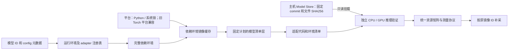

# 模型运行环境与适配器

AC-Prof 按模型选择逻辑 profile 和 adapter，profile 引用完整依赖环境，Docker 镜像缓存该环境的构建结果。
7 个任务族负责输入、调用和输出协议；平台负责 Python、OS/架构和系统依赖。
运行时由依赖环境声明；旧 Torch/CUDA 平台继续复用，`python-cpu` 平台不要求 Torch。主机只负责检测、规划和测量。
本文命令均从仓库根目录执行；示例资源配置不表示当前机器可用容量。

新增模型适配或调整镜像依赖时查阅本文。任务支持范围由[本文的任务目录](#任务支持范围)维护，
环境元数据的字段定义见 [采集协议](Profiling_Protocol.md#static_metajson-字段)，模块依赖见[代码架构](Architecture.md#主机编排与测量)。

- [任务支持范围](#任务支持范围)：按 NLP、视觉、多模态选择接口与清单。
- [当前配置](#当前配置)：选择运行环境，核对支持边界。
- [Runtime 预检与失败证据](#runtime-预检与失败证据)：核对版本、dtype、依赖、remote code 与兼容性状态。
- [本地模型声明与自定义 pipeline](#本地模型声明与自定义-pipeline)：补充缺失元数据、选择制品或映射标准任务协议。
- [MOSS 的执行约定](#moss-的执行约定)：仅在处理该 adapter 时读取。
- [构建、复用和验证](#构建复用和验证)：检查镜像、依赖清单与独立推理验证。
- [镜像分类与复用](#镜像分类与复用)：识别公共环境、模型文件、推理服务及辅助镜像。
- [镜像管理与清理](#镜像管理与清理)：查询和删除镜像，判断共享层与缓存的空间释放条件。
- [模型文件选择规则](#模型文件选择规则)：仅在修改下载、文件布局或缓存时读取。
- [新增一个模型适配](#新增一个模型适配)：按已有协议扩展 adapter。
- [参考实现与取舍](#参考实现与取舍)：查阅复用来源和依赖选择理由。



## 当前配置

| 逻辑 profile | 选择条件 | 依赖与接口 |
| --- | --- | --- |
| `multimodal-transformers4576` | 已支持的原生 `multimodal` 模型 | Transformers 4.57.6；`family-default` handler |
| `<family>-transformers560-<platform>` | NLP、CV、Audio、Multimodal 中旧 Auto 注册表未覆盖、5.6.0 已登记的原生架构 | 按任务和 `model_type` 选择；四个任务族共享每个平台的完整环境，仍用 `family-default` |
| `moss-transformers560` | MOSS 官方模型 ID，或 `model_type=moss_transcribe_diarize` | Transformers 5.6.0；`moss-transcribe-diarize` adapter |
| `<family>-cu128` / `<family>-cu124` | NLP、CV、Audio、Diffusion、Structured、Timeseries | 完整依赖锁；Torch 2.11.0 / 2.6.0，保留对应任务族接口 |
| `<family>-cpu` | 显式 CPU 索引或容器 CI | CPU wheel；同样使用完整依赖锁 |
| `onnxruntime-cpu` | structured 的 ONNX dense tabular 接口 | ORT 1.23.2、NumPy；CPU float32 |
| `onnxruntime-cv-cpu` / `onnxruntime-nlp-cpu` | ONNX 图像分类／文本分类 | 共用同一个无 Torch、无 Transformers 环境；Pillow 图像处理、Tokenizers 本地分词 |

[`runtime_profiles.py`](../acprof/runtime_profiles.py) 使用标准库声明三个独立对象：

| 对象 | 声明内容 |
| --- | --- |
| `RuntimeProfile` / `PROFILES` | 名称、任务族、adapter、模型/backend 约束、dtype、环境引用和版本线；当前共 40 个 profile。 |
| `PlatformSpec` / `PLATFORMS` | Linux amd64、固定 Python 基础镜像 digest、Python 3.10.21、系统锁；Torch 字段可省略。旧 CPU / cu128 为 Torch 2.11.0，cu124 为 2.6.0。 |
| `DependencyEnvironment` / `ENVIRONMENTS` | 平台引用及完整 Python 制品锁；当前有 27 个唯一环境；可用 `RuntimeSpec(type, version, package)` 核验运行时包的锁版本。名称仅用于引用，不决定内容身份。 |

`audio-cpu` 与 `multimodal-transformers4576-cpu` 共享 `audio-cpu` 环境；cu124 的对应两个
profile 共享 `audio-cu124` 环境。cu128 的 audio 使用 `tqdm==4.70.1`，原生 multimodal 使用
`4.70.0`，因此保留独立环境。MOSS 继续使用 Transformers 5.6.0 的专用 cu128 环境。
`transformers560-cpu/cu124/cu128` 是三个共享原生环境；复用 5.6.0 约束并加入 timm，不选择 MOSS adapter。
同族可有多个环境，不同族可共享环境；环境和 profile 数量均不要求长期保留同等数量的镜像。

完整锁位于 [`dockerfiles/locks`](../dockerfiles/locks)，源约束位于
[`dockerfiles/requirements`](../dockerfiles/requirements)。旧平台的 `platform-*.txt` 包含 Torch
必需依赖闭包和基础安装工具；`platform-python-cpu.txt` 只有基础安装工具。Flask、torchvision、torchaudio、NumPy、Pillow 等由环境完整锁声明。
每个包固定一个适用于目标 Python/ABI/架构的 wheel URL 和 SHA256，包括 pip、setuptools、wheel
及其依赖。各环境直接继承所声明的平台，不通过升级另一个环境来构建。CV 三个平台的锁新增
`timm==1.0.27`，因此环境身份改变；其余已有环境的包集保留。新运行时角色声明不改变相同完整
包集的身份；缺少包或锁版本不一致会失败。

系统锁 [`system-trixie-amd64.json`](../dockerfiles/locks/system-trixie-amd64.json) 固定基础镜像、
Debian `20260912T203535Z` 和安全仓库 `20260912T113611Z` 的实际 snapshot URL、签名索引摘要、
全部直接/传递系统包版本和新增/升级 `.deb` 的 URL、大小、SHA256。基础镜像已有包由 OCI digest
固定，并计入最终完整包集合。普通构建只下载锁中的制品，校验哈希后通过 `--no-download` 安装，
不查询浮动 apt 仓库、不动态选择包名。

主机使用 [`requirements/host.lock`](../requirements/host.lock)，支持 Python 3.10+。依赖集合与兼容区间只在
[`pyproject.toml`](../pyproject.toml) 声明；[`requirements/host.in`](../requirements/host.in) 是已验证版本约束，
安装直接指定 `requirements/host.lock`。主机、开发工具和测试依赖采用以下布局：

```text
AC-Prof/
├── pyproject.toml
├── requirements/
│   ├── host.in
│   ├── host.lock
│   ├── dev.in
│   ├── dev.lock
│   ├── test.in
│   ├── test.lock
│   ├── runtime-test.in
│   └── runtime-test.lock
├── acprof/
├── dockerfiles/
├── scripts/
└── tests/
```

以上只展示依赖相关目录。`dev.in` 和 `test.in` 通过相对路径 `-c host.lock`
约束共享包版本；安装和生成命令从仓库根目录执行。容器输入与制品锁仍位于 `dockerfiles/`。
锁更新工具固定为 uv 0.12.13。
生成目标 wheel 锁及检查主机 TOML 元数据需要 Python 3.11+；容器锁检查和运行代码仍支持 Python 3.10+。
主机检查离线核对 Python 3.10–3.14 的 marker 分支、直接依赖和 pin，不代表在这些解释器上运行过测试。

```bash
# 只读：锁格式、目标平台、源约束及 profile/环境映射；不访问 Docker 或网络
.venv/bin/python scripts/compile_locks.py --check
# 只读：主机声明、已验证约束与 lock 的版本一致性；需要 Python 3.11+
.venv/bin/python scripts/compile_locks.py --host-only --check
# 从 pyproject.toml 和已验证约束重新生成主机锁
.venv/bin/python scripts/compile_locks.py --host-only --uv .venv/bin/uv
# 保持当前全部包版本重新解析制品；--upgrade 才允许更新环境包
.venv/bin/python scripts/compile_locks.py --runtime-only --variant cpu --uv /path/to/uv
# 在固定基础容器中重新解析系统锁；只有此显式更新步骤运行 apt update
.venv/bin/python scripts/compile_system_lock.py --snapshot 20260913T000000Z
```

不带 `--check` 时，`--host-only` 只更新主机锁；`--variant` 可重复，省略时处理全部平台。迁移保留了原有全部 Python
包版本，仅补齐基础安装工具、目标制品及其哈希。更新锁后仍需执行目标容器验证。即使依赖和
来源完全锁定，也不宣称重建的 image ID 必然相同；复现实验和补采仍使用原始 image ID。

主机输入收敛复用 [uv 的 pyproject 与 constraints 编译方式](https://github.com/astral-sh/uv/blob/main/docs/pip/compile.md)。
沿用已有工具和锁格式，不引入新的包管理器或运行依赖；uv 提供 MIT 许可，解析仅在显式更新时运行。

主机构建预检沿用驱动兼容分支，CUDA 12.4 选择固定的 Torch 2.6.0 wheel，CUDA 12.8+ 选择 2.11.0。
`ACPROF_NLP_TORCH_INDEX_URL` 接受官方 `cu124`、`cu128` 和 `cpu` 索引；显式
`ACPROF_NLP_TORCH_SPEC` 必须与该分支的精确版本一致。其它组合需登记并验证自己的完整锁，
不再用无上界范围绕过锁。CPU 容器 CI 不证明 CUDA wheel 或所有模型的 GPU 兼容性。

支持任务标签不等于支持所有 checkpoint。已知不兼容的架构在任务预检退出；未登记的自定义
架构不会自动安装其 requirements 或执行主机端模型代码。通过静态检查的模型仍须完成实际
推理验证；CPU、GPU、dtype 和每种 profiler 的支持分别判断。

### 共享接口解析

主机在同一个模型 commit 读取文件列表及 `config.json`、`model_index.json`、`modules.json`、
`adapter_config.json`、`acprof_model.json`、`generation_config.json` 和 tokenizer/processor 配置，不执行仓库 Python。
即使 Hub 没有 `pipeline_tag`，仍保留 revision、文件与元数据，并从 architecture、`auto_map`、
`custom_pipelines` 和制品格式汇总候选。选择优先级为显式任务、本地／仓库声明、Hub 任务，
最后才使用唯一推导候选；多候选为 `ambiguous`，信息不足为 `needs_configuration`。
Hub 与模型声明的任务冲突必须显式选择；底层 loader 标签按下节规则分类。
`--task`／`--backend` 不能与有效模型声明矛盾。
ONNX 文件本身只能证明格式，不能凭输入 shape 猜分类、回归或预处理；这些语义须显式补充。

`model_resolution` 记录候选、证据、冲突、缺失项、选择结果以及格式、loader、operation、
`model_type`、元数据文件名与所选 profile。`status=candidate` 只表示通过静态检查，成功加载、
输入 dtype/shape 和真实输出仍由独立 `runtime_validation` 判断。元数据读取失败单独报告，
不能归因为任务不支持。
模型 ID 先经过本地格式校验；`model` 和 `namespace/model` 均合法，存在性由 Hub 元数据查询确认。
主仓库查找失败通过 `ModelLookupError` 保留模型 ID、revision、错误类别、诊断及原始异常链，业务层不退出进程。
仓库未找到与私有仓库不可访问可能返回相同错误，因此提示“未找到或无权访问”；明确的 gated/权限拒绝、
revision 不存在、离线模式、网络连接/超时、服务限流/故障分别处理，不通过错误文字猜测原因。
明确的仓库、权限或 revision 错误不继续配置回退，也不能用手动任务覆盖；临时网络失败仍可使用固定 SHA
的缓存配置恢复。已读取元数据但缺少任务的模型继续保留未决证据，不归为仓库不存在。
分类复用当前锁定的 Hugging Face SDK [异常类型](https://github.com/huggingface/huggingface_hub/blob/main/src/huggingface_hub/errors.py)
与 [ID 校验](https://github.com/huggingface/huggingface_hub/blob/main/src/huggingface_hub/utils/_validators.py)
（官方维护，Apache-2.0），不复制下载实现、不增加依赖；所有检查仅在正式测量前执行。

镜像站 HEAD 缺少 Hub 元数据头时，客户端对同一 revision 回退到官方 Hub；认证、文件不存在和
离线缓存错误不会触发这项回退。

Transformers 版本选择使用 [`extensions/transformers`](../acprof/extensions/transformers) 中从官方
固定版本导出的 Auto 注册表，按任务所需模型类与 `model_type` 匹配，不维护 checkpoint ID 白名单。
旧版本已经登记的架构继续使用旧环境；仅 `config.transformers_version` 较新不会强制升级。
CPU/CUDA 平台切换保留所选版本线。该候选选择目前面向 Transformers 原生 backend，
Sentence Transformers/CrossEncoder 继续使用其既有 4.57.6 环境；自定义 `auto_map` 由扩展与容器验证。
Auto 中存在类不保证 processor、pipeline、dtype 或所有 profiler 兼容。

### 解析证据与自动裁决

所有模型的 `model_resolution` schema v1 增加以下可选字段；历史报告缺字段表示未知，
不能补写为已验证。可执行 `acprof_model.json` 的 schema 和职责保持独立。

| 字段 | 含义 |
| --- | --- |
| `provenance` | schema v1 的来源图、观察项、resolver 版本、选择理由和 `identity_sha256`；只包含静态决策，不包含运行结果或时间戳 |
| `semantics` | `explicit/declared/inferred/conflict/unresolved`；表示所选 workload 的依据，不证明作者意图或模型质量 |
| `benchmark_kind` | 当前为 `task_pipeline`，沿用现有任务和四阶段 handler 协议；没有实现 `model_forward` 自动兜底 |
| `execution` | backend、handler 调用入口、执行阶段与计时协议；不把 pipeline 与其内部的 generation 当成互斥等级 |
| `adapter_origin` | 内置 handler 为 `builtin`，声明的 repository Pipeline 为 `repository`；生成声明不等于生成 adapter |
| `runtime_validation` | 初始为 `not_run`，之后记录实际 mode、镜像、payload hash、设备及验证结果；与静态语义分开 |

解析器读取 Hub `transformers_info` 的任务、Auto class 与 processor 提示。Hub 字段共享同一
source，Hub 与仓库配置保留共同 snapshot 的派生关系，不按字段数量投票，也不输出未经校准的
数值置信度。缺少已有架构匹配时，反查固定 4.57.6 / 5.6.0 Auto 注册表；多个任务仍保持歧义。
裸 `AutoModel` 不证明应执行哪一种任务。共享同一 Auto loader 的 translation/summarization
等任务不会仅因名称不同被判为结构冲突。

当 `transformers_info` 同时返回 `auto_model=AutoModel`、`pipeline_tag=feature-extraction`，
且 config 中的 custom Pipeline 声明使用该通用 Auto loader 时，这个库标签只记为
`loader_hint`，不作为任务候选或与 Hub 主任务产生冲突。原始字段保留在来源证据中，
`inspect --explain` 会说明其分类理由；其他库任务标签、缺少匹配 Pipeline 的情形仍按原规则检查。
唯一 custom Pipeline 可以继续进入静态契约分析，多个 Pipeline 仍须选择；
loader hint 本身不能补全缺失的任务语义，也不能使未解决的输入或依赖通过预检。

Hub 主任务存在时，`transformers_info.pipeline_tag` 若恰好是其 `auto_model` 对应的通用库任务，
且两个任务共享已登记的加载操作，则只记作 `loader_hint`。例如 summarization/translation 的
`text2text-generation + AutoModelForSeq2SeqLM`，以及 text-ranking/zero-shot-classification 的
`text-classification + AutoModelForSequenceClassification`。image-to-text 也可接受共享视觉生成
Auto loader 的 image-text-to-text 标签，包括 Hub 的 `AutoModelForMultimodalLM` 提示；
最终可用版本仍由所选 runtime 的注册表检查，不因此升级或借用其它环境的支持资格。
缺少匹配 Auto class、明确 head 不相容，以及 summarization 与 translation 这类两个具体任务
的冲突仍须选择。解析报告保留原标签、分类理由和来源哈希，不按榜单任务强制覆盖。

Sentence Transformers 的 feature-extraction/sentence-similarity 路径，若 `modules.json` 明确
声明从根目录加载 `sentence_transformers.models.Transformer`，实际使用的是 `AutoModel`。
此时底层 checkpoint 的 MLM/CausalLM head 与库标签只描述存储架构，不阻止声明的编码操作；
缺少该模块声明或选择了其它 backend 时不应用此规则。模块、processor、依赖与实际输出仍需验证。

声明、Hub task、具有任务语义的 `transformers_info.pipeline_tag` 冲突，或原生模型的明确 head 与任务操作
不相容时，保留候选并 abstain。显式 `--task` 可以解决元数据冲突，原冲突进入
`provenance.overridden_conflicts`；它仍不能违背有效的模型声明。
Interface Probe 或 Runtime Validation 成功不能修改这些静态裁决。静态来源摘要进入服务镜像 request fingerprint，
模型 SHA、声明与依赖仍沿用已有模型层和服务层身份规则。

实现复用 [Hugging Face Hub 的 ModelInfo/TransformersInfo](https://github.com/huggingface/huggingface_hub/blob/main/src/huggingface_hub/hf_api.py)，
借鉴 [Optimum TasksManager](https://github.com/huggingface/optimum/blob/main/optimum/exporters/tasks.py)
集中维护映射的方式。两者为 Apache-2.0 项目；使用现有 Hub 依赖和锁定静态注册表，不引入
Optimum 或主机端推理依赖，也不在正式测量窗口执行来源分析。
自定义 Pipeline 的选择参考锁定版本
[Transformers 4.57.6 的 pipeline 实现](https://github.com/huggingface/transformers/blob/v4.57.6/src/transformers/pipelines/__init__.py)
（Apache-2.0）：借鉴唯一接口优先的规则，继续使用本项目已有的受限 AST 分析和依赖检查，
不在主机执行 `trust_remote_code`，也不增加依赖或测量开销。
通用 loader 标签的分类同时参考固定版本
[Transformers pipeline registry](https://github.com/huggingface/transformers/blob/v4.57.6/src/transformers/pipelines/__init__.py)
和 [Sentence Transformers Transformer 模块](https://github.com/huggingface/sentence-transformers/blob/v5.1.2/sentence_transformers/models/Transformer.py)。
两者为 Apache-2.0；复用现有执行接口，不新增 backend 或放宽未知 library 的限制。

`audio-text-to-text` 的预检与容器加载共用 `model_resolution.audio_text_loader`，依据相同版本的
Auto 注册表选择 `AutoModelForSeq2SeqLM` 或 `AutoModelForImageTextToText`。对于组合模型，
可选择 config 中唯一已注册的多模态文本子模型；不会抽取普通语言模型而丢失音频编码器。
例如 Voxtral、Qwen2 Audio 使用 4.57.6 的共享 Seq2Seq Auto 接口；Qwen2.5 Omni 的文本子模型
通过 5.6.0 的 Auto 接口加载，不实例化 Talker。没有匹配或子模型选择有歧义时拒绝，
不轮流尝试加载模型类。原生架构的候选资格不再由音频模型名称名单决定。

更新版本时，用 [`export_transformers_support.py`](../scripts/export_transformers_support.py) 对固定 tag 的
`src/transformers/models/auto/modeling_auto.py` 和 `src/transformers/pipelines/__init__.py`
执行受限 AST 解析，分别记录源码 URL/SHA256；后者导出 task registry 和 aliases。
新导出的 dynamic-module capabilities 初始为 `null`（unknown），不能从 Auto 注册表推断。
仅重新导出相同 schema、version、source URL 和 SHA256 时保留已有 capability 评审；来源变化后重新验收。
`source_sha256` 仍只表示 Auto 注册表来源，不是 dynamic loader 的验证证明。

```bash
.venv/bin/python scripts/export_transformers_support.py \
  --source /path/to/modeling_auto.py --version 5.6.0 \
  --pipeline-source /path/to/pipelines/__init__.py \
  --output acprof/extensions/transformers/5.6.0.json
```

必须联动精确依赖锁和实际容器验证；注册表也参与服务构建指纹。未匹配到已登记环境的原生架构
提前拒绝。已知独立 adapter 缺少 base、GGUF 或缺少 `model_index.json` 的 Diffusers 单文件／组件
仓库也提前拒绝；本阶段没有增加这些制品的加载器。pyannote、SB3、LeRobot 等生态不能仅凭
Hub task 标签当作 Transformers 模型加载。

### Runtime 预检与失败证据

预检先确定逻辑 `runtime_profile`，再使用该 profile 的精确 Transformers lock 检查 Auto 和
pipeline registry。硬件选择 CPU/CUDA 平台后，会对最终 lock 再检查一次；一个版本支持不能
替另一个版本提供支持证据。GLM-OCR 的 `image-to-text` 在所选 5.6.0 registry 中不存在，
因此在下载权重、构建镜像、启动容器前返回 `runtime_task_unsupported`。
容器加载时还核对实际安装的 Transformers 版本与 profile lock，版本不一致返回
`runtime_dependency_incompatible`。自定义 pipeline 走明确注册的策略，不借用标准 task 注册资格。

`precision_policy` 由 profile 与 extension 合并，包含 `supported_dtypes`、`preferred_dtype`、
`device_overrides`、`task_overrides` 和 `model_type_overrides`。应用顺序为基础策略、设备覆盖、
task 覆盖、model type 覆盖；task/model type 内部也可声明设备覆盖。支持集合还必须满足
extension 的 `dtypes`。显式 loader `dtype` 不能越过支持集合或有证据的排除规则。
带版本、任务、设备和模型类型约束的 `rules` 可声明 `preferred_dtype`，覆盖匹配范围内的默认值；
显式请求仍有最高优先级，并接受同一支持集合与排除规则的检查。
策略不满足时返回 `precision_mismatch`，不会遍历其它 dtype 重试。

SAM/SAM2 目前只排除 `mask-generation + GPU + FP16 + Transformers 4.57.6`，依据是
2026-09-27 冻结审计中 sam-vit-base、sam2.1-hiera-tiny 的 NMS dtype 失败。
同一范围的默认值为 FP32，因为锁定版本的
[SAM processor](https://github.com/huggingface/transformers/blob/v4.57.6/src/transformers/models/sam/image_processing_sam.py)
将 NMS boxes 转为 FP32，scores 必须匹配；显式 FP16 继续提前拒绝。
这不改变其它版本、任务或模型的默认策略。离线随机小型 SAM 已验证 CPU/CUDA FP32 的
四阶段接口，不能外推为 sam-vit-base/huge 或全部 SAM2 checkpoint 已完成真实推理验收。
容器 probe 的 `dtype` 取自实际加载模型的浮点参数；无法观察时为 `unknown`，不从 CPU/GPU 名称猜测。
静态元数据中的精度是策略选择，实际 probe dtype 才是运行证据。混合精度模型列出观察到的
浮点参数类型，如 `mixed[torch.float16, torch.float32]`；原生 adapter 的局部精度约束仍需单独核验。

`dependency_preflight` 只分析固定 commit 的源码：从 `auto_map/custom_pipelines` 出发遍历本地
Python imports，最多 64 个文件、每文件 512 KiB；结合 tokenizer 配置及根目录
`requirements.txt`、`requirements-inference.txt`、`requirements-runtime.txt` 比较最终 runtime lock。
开发 requirements 不进入推理需求。包缺失、版本冲突、无法安全判断分别使用
`runtime_dependency_missing`、`runtime_dependency_incompatible`、`runtime_dependency_unknown`。
源码与 requirements 的 SHA256、模型 revision、lock 路径和比较结果保存在解析报告中。
动态 import、未知 import/distribution 映射、未固定 revision、URL/extras 等不能自动证明可用，
须补充受审阅的锁定环境。分析不 import 仓库代码、不执行安装命令，也不修改基础镜像。
裸相对 from-list 先核对包 `__init__.py` 的明确顶层绑定或重导出；无法证明时仍要求同名
子模块存在。条件、动态绑定以及 initializer 自引用均保持 unknown，不执行包代码来猜测结果。
RMBG 的 `skimage` 映射为 `scikit-image`；manga-ocr 的 MeCab tokenizer 明确要求 `fugashi`。
未指定版本的旧 `typing` backport 在目标 Python 3.5+ 中记录为 `stdlib`，保留 requirements
来源与目标 Python 版本；带版本限制的 `typing` 和 `typing-extensions` 仍按发行包检查。
这不消除 RMBG 对 `scikit-image` 的真实依赖缺口。

`trust_remote_code` 的有效值是 profile 允许且 extension 没有显式禁止。loader options 可进一步
收紧为 false，不能将 false 提升为 true。普通 family-default 遵循 profile；只有明确注册的
custom-code profile/adapter 才能开启，Interface Probe 也遵守同一策略。
TorchScript/graph/structured extension 的 `requires_model_spec` 在 resolver 消费：缺少
`acprof_model.json` 时返回 `needs_configuration` 和 `model_contract_required`，不猜输入语义。
已有 ONNX/skops 的安全格式推断规则保持独立，不推广到任意 TorchScript。

失败由 [`Failure`](../acprof/failures.py) 统一描述，CLI、audit、`models.csv`、TUI 和 `REPORT.md`
直接传递 `reason_code`；异常链与原始日志保留用于诊断。`request_timeout` 表示请求期限耗尽，
`compatibility_budget_exhausted` 表示独立验证整体预算耗尽，均为 `inconclusive`。
已有结果中的兼容性 JSON 按单文件 4 MiB 上限读取，并要求对象结构及有限数值；损坏证据记录为
`recorded_evidence_invalid` 和 `inconclusive`。同一结果目录中的有效 typed failure 继续优先展示，
不会因另一份产物损坏而被覆盖，也不会把损坏产物解释成模型本身不兼容。
真实推理异常使用 `inference_failed`，不能仅因为 60 秒未完成就认定不兼容。
默认 timeout 仍为 300 秒；显式重试使用更高 `--timeout-seconds` 和新的输出目录，不自动循环。
质量警告独立于 Capability，字段及历史结果边界见[质量与失败产物](Profiling_Protocol.md#质量与失败产物)。
HTTP 响应为 401/403 的失败在原阶段记录 `access_denied` 和 `http_status`，包括文件计划阶段的
gated 配置读取；不会因已有缓存配置可通过静态检查而宣称获得权重权限，也不将 429 当作权限失败。

实现参考锁定的 [Transformers 4.57.6 pipeline registry](https://github.com/huggingface/transformers/blob/v4.57.6/src/transformers/pipelines/__init__.py)
和 [5.6.0 registry](https://github.com/huggingface/transformers/blob/v5.6.0/src/transformers/pipelines/__init__.py)，
并使用两版本 `PreTrainedModel.from_pretrained(output_loading_info=True)` 的结构化 loading info
捕捉权重初始化与未使用权重（[4.57.6 源码](https://github.com/huggingface/transformers/blob/v4.57.6/src/transformers/modeling_utils.py)、
[5.6.0 源码](https://github.com/huggingface/transformers/blob/v5.6.0/src/transformers/modeling_utils.py)）。
Chronos 沿用其 [`from_pretrained` 参数协议](https://github.com/amazon-science/chronos-forecasting/blob/main/src/chronos/chronos.py)。
这些上游采用 Apache-2.0；AC-Prof 复用现有库与静态快照，不新增推理依赖。
依赖比较使用已有 lock 中的 `packaging==26.3`，现将其列为直接主机依赖；安装包集合不变。
快照随锁版本评审，加载观察在初始化完成后恢复原方法；依赖分析和质量持久化均在正式测量窗口外。

### 自动生成模型契约（M1～M6）

未提供本地或作者 `acprof_model.json` 时，`detect_task` 对声明了唯一 `custom_pipelines` 的
音频／图像／视频转文字任务收集证据，再生成兼容现有 schema v1 的 draft。
任务取自 Hub 或显式覆盖，Pipeline 取自 config；README 中 Python 示例的字典键仅作为补充证据。
已有作者声明保持优先，其任务／backend 与 Hub 或显式覆盖的冲突仍须解决。

主机只读取同一完整 commit SHA 下的 JSON、README 和 Python 文本。config fallback 必须取得
Hub cache 的固定 snapshot 后才分析内容。AST 沿声明文件和相对 import 读取，最多 32 个源文件、
总计 2 MiB、单文件 256 KiB、单个 AST 20,000 个节点；不会 import、eval 或执行模型代码。
结构化 JSON 的读取上限为 1 MiB；依赖索引保留 4 MiB 上限。已经固定完整 SHA 的静态文件
先通过 Hub `hf_hub_download(dry_run=True)` 查询大小和 commit，未知或超限大小、SHA 不一致
直接拒绝，不请求文件正文；实际下载和镜像回退继续使用同一 SHA。缓存命中也检查大小，
下载后再次核对文件大小，并在解析前执行有界读取。固定版本的 config、Diffusers
`model_index.json`、依赖索引和源码均使用此边界。

尚未固定 revision 的 config fallback 保留 SDK 的分支／tag 解析与 ref 写入，确保首次下载后
仍能按默认分支离线复用；返回路径仍须通过固定 snapshot 检查。此 fallback 在下载后、
解析前限制文件大小，首次网络下载量暂不具备同样的下载前上限；不把它描述为有界下载。

此边界采用现有 `huggingface_hub>=1.0` 的公开 API，参照
[Hub v1.0.0 下载实现](https://github.com/huggingface/huggingface_hub/blob/v1.0.0/src/huggingface_hub/file_download.py)
及 [dry-run PR #3407](https://github.com/huggingface/huggingface_hub/pull/3407)（Apache-2.0）。
不使用 `local_dir` 或上游私有下载实现，不增加依赖；额外预检只发生在准备阶段。

自动解析限于可确认的 Pipeline 子集：

- 本类直接定义的 `preprocess`、`_sanitize_parameters`、`_forward`、`postprocess`。
- `inputs["key"]`、`inputs.get("key", literal_default)`，保留必填性、默认值和来源行。
  媒体字段沿用 canonical 名称；字符串文字输入接受 `text` 或 `prompt` 的字符串默认值。
  需要 `messages`／`turns` 等嵌套结构时保留缺口，通过下述输入模板表达，不把字符串直接映射成对话列表。
- sanitize 的 literal key 集合与 forward 的明确参数签名。生成上限必须直接传入
  `generate(max_new_tokens=max_new_tokens)`；确定性来自显式 `do_sample` 参数，或源码中
  `temperature = temperature or None`、`do_sample = temperature is not None` 的直接赋值链。
  不能仅凭参数名推导 `temperature=0`，动态 kwargs、重写输入映射及不支持的控制路径需要声明／adapter。
- `register_pipeline` 的 literal 名称用于交叉核对。方法存在不证明 tensor shape、输出类型或真实推理成功。

`model_resolution.contract` 保存独立 provenance：字段的 `value/state/sources`、源文件 hash、
resolver 版本、锁定环境的 Transformers 版本、draft、依赖候选和未解决字段。状态为
`declared/derived/verified/ambiguous/unresolved`；静态分析只产生声明或推导，`verified` 来自实际 Probe。
`contract.status=resolved` 表示静态契约完整，外层仍为 `candidate`；真实执行证据继续保存在
独立 `runtime_validation`。冲突或缺口使外层成为 `ambiguous/needs_configuration`，并在构建前停止。
`contract.status=needs_confirmation` 汇总未决字段；TUI 正式采集只在有可裁决的未决项时暂停询问，
答案交回 resolver 重新解析，所有必填字段 resolved 后在原进程继续。已确定字段只读展示，修改与内部证据默认折叠。
输入映射和依赖选择写入 `reviews`，来源标为 `user.review`；多 Pipeline 选择会在同一 SHA 上重新分析。
动态源码、任务冲突等不能由当前字段编辑器解决的问题仍要求显式声明／adapter。

只有无缺口的 draft 才进入 `generated_spec`，由已有模型声明入口传给镜像指纹、通用 handler、
server 和 profiler；不会修改作者文件或 Hub snapshot。正式运行在准备阶段导出
`model_resolution.json`，同时保留 `static_meta.json.model_resolution`。单独查看失败 draft 可使用：

```bash
acprof inspect fixie-ai/ultravox-v0_5-llama-3_2-1b --explain \
  --output-dir internal-testing/model-resolution
```

`cache_key` 包含模型 ID、SHA、resolver 版本、Transformers 版本、完整文件清单和依赖控制流证据；AST 分析按源文本在
进程内缓存，Hub 文件复用其内容缓存。依赖 SHA、文件选择和用户决策也参与静态身份；没有跨进程的
解析结果缓存，也不复用旧运行验证。运行观察单独追加，不改变已经建立的静态身份。
JSON 元数据 hash 使用 canonical JSON；Python／README hash 使用所分析的 UTF-8 文本，报告会标明前者。

TUI 另有**用户确认选择缓存**，不是上述解析结果缓存：输出根目录 `.model-contracts/decisions/`
只保存答案和模型 ID、SHA、contract cache key、provenance identity、显式配置。下次仍读取当前证据，
身份一致才重新应用答案并校验支持性。显式 task／family／backend 不得被答案或推断替换；不兼容
声明明确拒绝。CPU Probe、历史验证或静态 resolved 都不能代替本次所选设备的完整运行验证。

采集准备阶段由 `host.collection_workflow` 连接静态解析、主机预检、镜像、输入和 runtime validation。
失败阶段保留其上游成功结果；普通“重新验证”复用原不可变镜像和输入，“重新准备环境”则使镜像及
下游输入／验证失效后重建。正式测量期间不询问用户、不轮询控制通道、不做阶段重试。
具体按钮和恢复边界见 [TUI 工作流](TUI.md#模型契约解析与验证)。

外部 `from_pretrained` 调用按 tokenizer、processor、metadata、weights 等角色记录候选；
config 中的模型引用和动态表达式也会保留。明确的 repo／loader 通过 Hub 自动固定 SHA，按角色生成
兼容 v1 的 `dependencies/allow_patterns`：tokenizer／processor 只选根目录配置、词表和模板，以及
单层 `chat_templates/`；不会因名称前缀匹配而选中子目录快照或权重。metadata
只选 `config.json`；weights 选择一个标准 Transformers 权重格式及存在的 `generation_config.json`。
主模型与依赖共用 checkpoint 解析器：分片索引按 `weight_map` 的文件集合解析，支持合法自定义
分片名和子目录；任一必需分片缺失即报错，不靠标准编号文件名猜测，也不改用另一套权重。
解析只读取固定 SHA 的索引元数据（最多 4 MiB）；下载前按同一 SHA 查询该路径的大小，
大小未知或超限时直接拒绝，下载后再次有界读取。纯 tokenizer 解析不增加索引查询。
保留相对路径校验、十万条仓库清单和每依赖
128 个选择文件的上限。显式 `allow_patterns` 的依赖在 Model Store 下载权重和构建前也校验
选中 checkpoint 的完整性；纯 tokenizer／processor 依赖无需权重。
`AutoFeatureExtractor` 的 processor 只选 `config.json/preprocessor_config.json`，不附带 tokenizer 或权重。
实际下载继续使用镜像构建阶段的
既有 planner、文件 hash 和离线缓存，主机解析不下载权重。最多 16 个依赖，每个最多 128 个文件。
候选不等于运行时必需，`pinned` 也不代表文件已下载。依赖分析采用以下有界规则：

| 证据 | 处理 |
| --- | --- |
| `activation=active` | 在所分析加载入口和配置下可达，按 role 解析 SHA 与文件 |
| `activation=inactive` | 固定配置或已证明的选择路径排除了该调用；保留证据，不查询／下载 |
| `activation=unknown` | 动态条件或未能建立调用上下文，保留 review，不查询／下载该候选 |
| `dependency_kind=main_model` | 已声明主模型的 `super().from_pretrained` 转发，或已知 loader 对当前 snapshot 的自引用；不重复规划外部下载 |
| `alternative` | 保留同一 `try` 中的 primary/fallback 关系；未证明 primary 完整时，fallback 为 unknown |

固定 config 的 `None` 判断、布尔组合、简单赋值和同一 snapshot 内的函数调用可传递已知值。
普通参数、keyword-only 参数及已知 `*args/**kwargs` 会绑定到 loader；`call_chain` 保存来源。
动态 kwargs 不得抹去 revision；未知装饰器、动态训练条件、循环／match、递归或超出分析边界仍需 review。
本地调用最多 12 层、256 个调用上下文、512 个候选和 100,000 个分析步骤，不执行任意 Python。

主模型 tokenizer 的 primary 仅在固定文件清单含 `tokenizer.json/tokenizer_config.json`、
声明为 `PreTrainedTokenizer/PreTrainedTokenizerFast`、没有 custom tokenizer `auto_map`，且调用只使用
已知默认选项时，获得静态文件完整性证据。直接 loader 和仅转发／返回结果的 helper 可据此将 fallback
标为 inactive；额外处理、动态参数或缺文件仍为 unknown。文件完整性不保证内容有效或运行成功。

已登记的 Transformers 4.57.6 `PreTrainedModel` 使用版本限定的加载阶段摘要：构造期间关闭初始化，
随后分析模型的权重初始化 hook；候选的 `loader_context` 记录版本与阶段。这个摘要只用于已声明的
主模型及本地调用链；其他版本、任意 `dynamic_training_mode()` 和未知 framework 状态不会被猜成 true。
`active` 是加载规划中的可达性，不是某次实际运行已执行该分支的证据。

控制流按调用及 role 判断，再合并同 repo 的有效文件需求。`audio_model_id=None` 可排除 audio weights，
同时从 `audio_config._name_or_path` 激活 processor；不能按 repo 整体删除。多个 revision、非默认分支别名
及无法匹配的文件结构保持未决。TUI 依赖项只需给出 `repo_id/role`，
可用 `required:false` 明确排除未使用的候选；SHA 和 patterns 自动补齐，不推断任意 Python 依赖闭包。
作者已固定的依赖不会重新解析。`fixie-ai/ultravox-v0_5-llama-3_2-1b` 的固定 snapshot
`b95bec8ab291eeb04b5cd600dd473377f6b79026` 可自动生成完整静态契约，包括 Llama weights 和 Whisper
processor；主模型转发、音频权重分支及已证明的 tokenizer fallback 被排除。其任务、输入、生成参数、
依赖仓库／SHA 和所需角色与 `examples/multimodal/ultravox.model.json` 一致；文件按实际角色精确选择，
不照搬示例中的宽泛 `*.json`。该案例以固定源码 fixture 验收，生产逻辑没有 checkpoint 名称特判。

采集生命周期统一为：

```text
resolve → interface validation → prepare runtime → runtime validation → matrix measurement
```

Static Resolution 只读取固定 revision 的文本和 AST，不在主机执行仓库源码。
Interface Probe 使用 `source_bundle.py` 消费静态解析已有的源码图、`repository_sources` 和 metadata；
缓存存在时不重新联网，缺少已声明文件时只获取该文件。bundle 只包含已确认的 `.py`、`config.json`、
tokenizer／processor 的小型 JSON metadata 与 `acprof_model.json`；源码数量、大小和 SHA256 都有界，
并核对完整 commit SHA。相对导入的子模块与 package initializer 同样进入源码图。
权重后缀、路径越界、缺失依赖或源码身份不一致直接失败，缺图报告
`interface probe source graph incomplete`，不调用 snapshot 下载，也不扩展 `model_download_policy`。

`acprof inspect MODEL --probe-interface` 可独立运行相同的 Interface Probe。runner 只使用选定
profile 的 dependency base、AC-Prof 服务源码副本和 Source Bundle，完全脱离 `prepare_image()`、
`prepare_model()` 与 Model Store。它检查 import 和 `inspect.signature.bind`，不实例化权重、不做
preprocess 或 inference；默认 CPU 2 核、4 GiB，容器上限 300 秒，依赖镜像准备不在此超时内。
容器断网、read-only、挂载只读、移除 capabilities、禁止提升权限；临时缓存写入 `/tmp`，
不挂载主机凭据、Docker socket 或模型目录。结束或取消后按不可变 ID 清理容器和临时目录。

自定义 Pipeline 共用 [`load_local_pipeline_class`](../acprof/container/local_pipeline.py) 和既有
remote-code 策略；`auto_map` 同样检查策略，导入均为 `local_files_only=True`。
Transformers 精确版本的 loader 选择与能力声明继续遵循
[dynamic-module 兼容生命周期](#transformers-dynamic-module-兼容生命周期)。
接口证据单独写入 `interface_validation.json`、`logs/interface_validation.log` 和
`model_resolution.interface_validation`，不改写静态裁决或冒充真实推理。

Runtime Validation 就是现有 `validate_runtime()`，按 `prepare_image → plan_input_scales →
validate_runtime → run_matrix` 顺序使用正式镜像、Model Store、adapter 和 workload。
每个选中设备执行一次最小合法输入，完整经过 load、preprocess、predict、postprocess、validate_output。
CPU + GPU 必须两者成功；失败、OOM、超时或缺少阶段证据均阻止正式矩阵。
报告仍为 `runtime_validation.json`，含每个设备的日志、输入 hash 和镜像身份；历史协议的 `mode=full`
表示端到端验证，新执行入口不再提供 basic/full 选择。它不产生正式 CSV row，不开启 profiler 测量窗口。

两类验证都不能代替所选 profiler 或正式矩阵实测。`profiling-mode basic/full` 只表示采集指标范围，
不表示模型检查深度。TUI 自动执行整个准备流程，交互见[模型确认](TUI.md#模型契约解析与验证)。

实现参考 [Hugging Face 单文件缓存下载](https://github.com/huggingface/huggingface_hub/blob/main/src/huggingface_hub/file_download.py)
与 [Transformers dynamic modules](https://github.com/huggingface/transformers/blob/main/src/transformers/dynamic_module_utils.py)
（Apache-2.0），以及 [Textual worker 取消讨论](https://github.com/Textualize/textual/discussions/4510)
（项目为 MIT）。复用现有依赖和版本能力表，只借鉴缓存、隔离与生命周期处理方式，不复制整套实现、
不新增下载模式或第三方依赖；新增准备工作均在正式测量窗口外。

输入 DSL 在 schema v1 中兼容旧字符串重命名，并增加 `from`、`literal` 和 `template`：

```json
{
  "turns": {"template": [{"role": "user", "content": {"from": "text"}}]},
  "audio": {"from": "audio"},
  "sampling_rate": "sampling_rate",
  "speaker": {"literal": "user"}
}
```

以上对象放在 `multimodal.inputs`。所有任务要求的 canonical 输入必须被引用；模板只允许 JSON
结构和已知输入引用，最多 8 层、256 个节点、每个容器 32 项、字符串 4096 字符，整份 spec 仍限
64 KiB。无 Python、eval、文件／环境访问或字符串插值；每次生成新容器结构，媒体数据保持原值。
转换在既有 preprocess 阶段完成，server 与 profiler 共用 handler。

实现借鉴 [Transformers 4.57.6 Pipeline](https://github.com/huggingface/transformers/blob/v4.57.6/src/transformers/pipelines/base.py)
和[动态模块加载边界](https://github.com/huggingface/transformers/blob/v4.57.6/src/transformers/dynamic_module_utils.py)
（Apache-2.0），并以 [Ultravox Pipeline](https://github.com/fixie-ai/ultravox/blob/main/ultravox/model/ultravox_pipeline.py)
（MIT）核对模式。复用接口思想，以标准库 AST 实现受限分析，不复制 loader、不新增主机推理依赖；
所有下载、解析和报告写入均位于正式测量窗口外。

三态分支与合流参考 [Pyright 的代码流收窄](https://github.com/microsoft/pyright/blob/main/docs/type-concepts-advanced.md)
（MIT）；加载阶段和 tokenizer 文件规则分别核对
[Transformers 4.57.6 modeling_utils](https://github.com/huggingface/transformers/blob/v4.57.6/src/transformers/modeling_utils.py)
与 [tokenization_utils_base](https://github.com/huggingface/transformers/blob/v4.57.6/src/transformers/tokenization_utils_base.py)
（Apache-2.0），角色分离另对照
[Ultravox prefetch_weights](https://github.com/fixie-ai/ultravox/blob/main/ultravox/training/helpers/prefetch_weights.py)
（MIT）。只借鉴有界分析与 API 语义，保持标准库实现；升级锁定的 Transformers 版本须复核阶段摘要，
未登记版本继续保留 unknown。测试 fixture 保留上游源码许可，作为文本输入，不导入执行。

依赖规划另参考 [Hugging Face snapshot 下载器](https://github.com/huggingface/huggingface_hub/blob/main/src/huggingface_hub/_snapshot_download.py)
（Apache-2.0）的固定 revision 与文件过滤；TUI 使用 [Textual Workers](https://github.com/Textualize/textual/blob/main/docs/guide/workers.md)
（MIT）的后台任务边界。均复用现有依赖，不复制上游 loader；DSL 是有界 JSON 解释，不引入模板执行引擎。

### Transformers dynamic-module 兼容生命周期

[`extensions/transformers`](../acprof/extensions/transformers) 的每个精确版本维护两个 capability：

| 字段 | 原生 loader 必须满足的能力 |
| --- | --- |
| `local_dynamic_transitive_imports` | 空缓存、离线时递归准备 `A → B → C` 的本地相对依赖 |
| `local_dynamic_symlink_safe` | snapshot 文件指向 Hub blobs 时，仍按 snapshot 名称发现和加载相对依赖 |

4.57.6 和 5.6.0 的两项声明目前均为 `false`，继续使用
[`compat/transformers_dynamic.py`](../acprof/container/compat/transformers_dynamic.py)。该 shim 保留已有行为：
复用 Transformers 的依赖发现、缓存路径和类导入，只补齐递归缓存文件，不修改 snapshot 或 blobs；
缺失源文件在执行入口前报告原 snapshot 路径，实际导入异常继续上传。
`false` 表示当前不能依靠完整的原生加载路径通过该项验收，不表示每个 symlink 场景均会失败。

只有两项都明确为 JSON 布尔值 `true`，公共入口才直接调用 Transformers
`get_class_from_dynamic_module()`；该分支不导入 shim，也不执行 AC-Prof 的依赖遍历或手工复制。
任一已评审能力为 `false` 时走 compat。未登记版本、目录版本不一致、字段缺失、`null` 或非布尔值
均 fail-closed，在导入自定义模型代码前报错；不使用 `version >= x`、最近版本或异常后回退来猜测。
版本别名及带本地构建后缀的版本也须独立登记。旧 `acprof.container.dynamic_modules` 入口已移除，
调用者统一使用 `acprof.container.local_pipeline`。

新增 runtime 的固定验收顺序为：**固定 tag/commit 上游源码确认 → transitive import test →
snapshot→blobs symlink test → offline + clean-cache test → 代表性模型 Interface Probe 与 Runtime Validation → 标记 capability=true**。
同时保留 circular import 终止、missing dependency 原路径诊断与 import exception 传播检查。
验收须保存精确包版本、源码 commit/SHA256、运行环境及测试/Probe 产物；不能仅凭新版号或某个 PR 已合并改表。

[`test_local_pipeline.py`](../tests/test_local_pipeline.py) 验证两条路由和未知声明；
[`test_local_pipeline_native_runtime.py`](../tests/test_local_pipeline_native_runtime.py) 复用已有五项依赖回归，
执行实际安装的上游 loader，同时禁止导入 shim。已登记 native runtime 自动执行该组；评审候选版本时，
在隔离的候选容器中设置仅供测试使用的 `ACPROF_TEST_NATIVE_TRANSFORMERS=<精确版本>`，并运行：

```bash
ACPROF_TEST_NATIVE_TRANSFORMERS=<精确版本> python scripts/run_tests.py \
  --pattern test_local_pipeline_native_runtime.py --require-no-skips \
  --report /evidence/native-dynamic-modules.json
```

测试只在子进程中临时替换 capability 声明，不替换上游 loader；实际安装版本不符会失败。
正式 loader 不读取这个测试开关。候选依赖需提前准备，执行回归时容器断网、snapshot 只读，
`HF_MODULES_CACHE` 指向新的可写临时目录。该组通过只证明动态加载契约，仍需在目标环境执行
Ultravox 等代表性 checkpoint 的 Interface Probe 与 Runtime Validation；不据此宣称 GPU、profiler 或完整模型推理已通过。
代表性 Probe 使用隔离候选 checkout／镜像中的临时能力声明，所有验收通过后才更新正式支持表。

shim 只有同时满足以下条件才能删除：

- 所有正式支持的 Transformers runtime 都原生支持 transitive relative imports。
- snapshot→blobs symlink、clean-cache + offline、circular 和 missing dependency 回归全部通过。
- 不再支持任何仍需 workaround 的旧 runtime。
- Ultravox 等代表性模型的 Interface Probe、Runtime Validation 及相关实际推理验证通过。

参考上游 [递归复制 PR #46022](https://github.com/huggingface/transformers/pull/46022)、
[symlink 修复讨论 PR #46611](https://github.com/huggingface/transformers/pull/46611) 和
[Transformers 5.13.0 loader 源码](https://github.com/huggingface/transformers/blob/v5.13.0/src/transformers/dynamic_module_utils.py)
（Apache-2.0）。复用已维护的原生接口，不复制整套 loader，也不新增生产依赖；正式支持版本和锁不会因候选回归而升级。

### 本地模型声明与自定义 pipeline

`acprof run` 和 `acprof probe` 接受 `--model-spec /path/to/model.json`，覆盖 snapshot 中的
`acprof_model.json`。JSON 必须声明 `schema_version=1`、`format`、标准任务 `task`，最大 64 KiB。
制品接口使用 `format=onnxruntime/torchscript/skops` 和相对 snapshot 的 `model_file`；
ONNX 图像／文本还需[对应预处理声明](#扩展声明与按需加载)。结构化任务的 `feature_dim`
可驱动输入生成，workload 中显式指定的不同宽度会报错。`--model-spec` 描述模型接口，
`--workload-spec` 描述输入样本、生成与实验参数，二者职责独立。

例如没有 Hub 任务标签的 Iris 可使用仓库中的声明与合成输入清单：

```bash
acprof run --model Ritual-Net/iris-classification \
  --model-spec examples/onnxruntime/iris.model.json \
  --workload-spec examples/onnxruntime/iris.json \
  --profiling-mode basic --cpus 1 --mems 2 --gpus off \
  --input-scales 1 --warmup 1 --repeat 2 --repeat-in-window 1 \
  --notify none --output-dir results/iris
```

[`iris.model.json`](../examples/onnxruntime/iris.model.json) 选择 `iris.onnx`、
`tabular-classification`、4 列输入；无需修改上游仓库或添加 Iris 专用 handler。
这是运行链路示例，合成输入不用于 Iris 准确率评估。

声明自定义 pipeline 别名时，显式映射到已有任务协议，例如：

```json
{
  "schema_version": 1,
  "format": "transformers-pipeline",
  "task": "text-classification",
  "pipeline_task": "acme-classify"
}
```

`config.custom_pipelines` 必须包含所选 `pipeline_task` 及其 `impl`。已有 NLP、CV、Audio
pipeline handler 按该别名加载，输入生成、有效尺度和输出仍按标准 `task` 处理。
多模态文字输出可使用下述共享声明；其他自定义协议仍需 adapter。
`auto_map` 声明也只产生候选，不保证兼容锁定的 Transformers。
主机静态检查代码引用属于同一固定 snapshot，保存 `code_files/code_revision`；跨仓库代码引用
或缺少文件明确拒绝。自定义代码保留完整 snapshot，接口验证在无网络容器中执行；缺少依赖需
登记完整环境锁，不在验证或正式请求期间自动安装。

有效声明进入服务镜像构建指纹及 `runtime_environment.model_spec`，由构建期环境变量
`ACPROF_MODEL_SPEC_B64` 传入，server、独立验证与 profiler 使用同一份内容。不会改写 Hub
snapshot；本地文件路径与 SHA256 进入恢复身份，内容改变不能沿用旧实验。依赖层和模型文件层
仍可复用；改变下述离线依赖会重建模型文件层。发现与输出验证位于测量窗口外。
NLP/CV/Audio 自定义 pipeline 沿用各自 handler 的计时口径。

#### 声明多模态输入与推理参数

`audio-text-to-text`、`image-text-to-text`、`video-text-to-text` 可通过 `multimodal` 声明
复用 `family-default` handler，无需按模型名称新增分支。以下是音频接口示例：

```json
{
  "schema_version": 1,
  "format": "transformers-pipeline",
  "task": "audio-text-to-text",
  "pipeline_task": "ultravox-pipeline",
  "multimodal": {
    "inputs": {"prompt": "text", "audio": "audio", "sampling_rate": "sampling_rate"},
    "forward_kwargs": {"max_new_tokens": "$max_new_tokens", "temperature": 0.0}
  }
}
```

`inputs` 的键是上游 `preprocess` 接收的字典字段，值引用 AC-Prof 解码后的输入：

| 标准任务 | 必须完整映射的输入 |
| --- | --- |
| `audio-text-to-text` | `text` 字符串、`audio` 单声道 NumPy 波形、`sampling_rate` |
| `image-text-to-text` | `text` 字符串、`image` RGB PIL 图像 |
| `video-text-to-text` | `text` 字符串、`video` 有序 RGB NumPy 帧、`fps` |

`forward_kwargs` 传入上游 `_forward`；`$max_new_tokens` 引用 workload 的生成上限，必须声明。
`$do_sample` 引用经过校验的 `false`；也可显式用 `do_sample=false` 或 `temperature=0`。
省略时默认映射 `max_new_tokens` 和 `do_sample`。不允许未知参数引用或随机采样声明。
当前协议仅支持 batch size 1、返回张量字典的 `preprocess` 和返回一个字符串的 `postprocess`；
必须保留 `input_ids` 及可识别的模态特征，缺失输入、尺度截断或输出不符会在独立验证时报错。

加载、媒体解码／上游 `preprocess`／设备传输、上游 `_forward`、输出解码分别落在现有四阶段，
正式推理窗口只调用 `_forward`。输出 token 数仍是对返回文字重新分词的计数；没有实际生成
token 证据时，相关生成速率／逐 token 工作量保持不可用，不用上限或字符数代替。

共享环境 `custom-multimodal-cpu/cu124/cu128` 在原 4.57.6 锁基础上加入 `peft==0.17.1`，
保留已有包版本。CPU 使用 FP32，GPU 使用 FP16。参考
[Transformers Pipeline 契约](https://github.com/huggingface/transformers/blob/v4.57.6/src/transformers/pipelines/base.py)
和 [UltravoxPipeline](https://github.com/fixie-ai/ultravox/blob/main/ultravox/model/ultravox_pipeline.py)
拆分执行阶段；前者与 PEFT 为 Apache-2.0，Ultravox 代码为 MIT。模型代码来自固定 snapshot，
只在容器中执行。其他依赖组合仍需登记独立完整环境锁。

#### 外部模型与 processor 的离线依赖

可选 `dependencies` 数组声明上游代码在加载时还会读取的 Hub 仓库，每项包含 `repo_id`、
固定 40 位 commit `revision`，以及可选的相对文件 `allow_patterns`。最多 16 个不同仓库，
不能覆盖主模型；不声明 patterns 时下载依赖仓库完整 snapshot。主机准备阶段校验文件哈希后，
在 Model Store 的固定计划视图中将各依赖的 `refs/main` 绑定到声明 commit，容器只读挂载该视图，
使上游无 revision 的 `from_pretrained(repo_id)` 也能离线解析。主模型和全部依赖进入下载计划与镜像身份，正式服务保持断网。

[Ultravox 完整声明](../examples/multimodal/ultravox.model.json) 包含固定版本的 Llama 基础权重与
Whisper processor。Llama 仓库要求账号已获访问许可，并在主机准备阶段配置有效 `HF_TOKEN`；
缺少权限不能靠修改任务覆盖项解决。在 TUI 的“高级参数 → 识别覆盖 → 模型接口声明”填入
`examples/multimodal/ultravox.model.json`，或在 CLI 使用：

```bash
acprof run --model fixie-ai/ultravox-v0_5-llama-3_2-1b \
  --model-spec examples/multimodal/ultravox.model.json \
  --profiling-mode basic --cpus 2 --mems 12 --gpus on \
  --input-scales 1 --batch-size 1 --warmup 1 --repeat 2 \
  --repeat-in-window 1 --notify none --output-dir results/ultravox-basic
```

此命令是配置示例，不表示完整 checkpoint 已验证通过；声明后的状态仍为 `candidate`，
加载、预处理、推理和输出验证均成功后才成为本次运行的 `verified`。

## 扩展声明与按需加载

`acprof/extensions/*/manifest.json` 是共享声明目录，标准库 JSON loader 在主机与容器读取，
不导入 Handler 或可选依赖。每条声明包含 ID、任务族、任务／架构匹配、backend/runtime、
profile/environment 引用、CPU/CUDA、dtype、输入模态、batch、streaming、measurement 状态、
Handler 和 validator 的 `module:callable` 入口。可选 `execution_entrypoint` 提供运行时上下文；
空值采用 CPU/nullcontext，Torch 声明指向 `container.torch_execution`。
声明只描述能力，实际执行仍由 `BaseHandler.load → preprocess → predict → postprocess` 完成。

内置 profile 的环境变体由声明的 `environments` 映射选择。已有架构的新 checkpoint 通常只需模型配置；
新的架构在已有任务协议下增加 Handler／manifest／validator；新 backend 再增加完整依赖环境和锁。
不同任务协议仍需相应 workload 与输出描述；声明不能让不兼容模型自动变为兼容。
`RuntimeProfile`、`DependencyEnvironment`、模型 snapshot 和执行 Handler 各有自己的身份。

注册默认拒绝重复 `(family, backend)`／adapter key；错误包含原、新实现和来源模块。
`register(..., override=True)` 才允许替换。`_auto_register()` 只登记入口字符串，选中时才导入和构造。
未选 backend 缺依赖不影响启动；选中的 backend 在导入或模型加载失败时保留原始 exception chain，
分别报告未注册、依赖缺失、模块导入失败、Handler 初始化失败与不支持。

内部 extension manifest 使用 `schema_version: 2`，v1 和未知字段直接报错；不加载外部插件目录。
类型化字段与校验位于 [`extensions/schema.py`](../acprof/extensions/schema.py)。
`acprof_model.json`、workload 清单和结果文件各自的 schema 版本保持独立。

`ExtensionCatalog.resolve(task, family, library, config)` 是 backend/family 的共同解析入口，
返回选中的声明、设备精度和 IO 格式；`describe(task_info)` 用于已经选定 backend 的消费端。
显式 backend 优先，并校验 task/family/backend 路由；未知 library 不再默认进入 Transformers。
检测阶段保留未决元数据供 CLI 覆盖或契约审阅，候选解析将错误记录为 `needs_configuration`，
预检在构建或采集前拒绝未解决的组合。

`backend_rules` 的选择顺序为：制品布局证据（`artifact: true`）→ task 规则 →
library/config 规则 → family 规则，随后才可使用已声明的 `library_backends` 映射。
每个层级内按整数 `priority` 从高到低选择；同优先级命中不同 backend 时报歧义，文件顺序不决定结果。
`when_config` 的 `true` 表示字段存在且非空，其他值要求相等。Chronos 的配置标记及缺失 task
的推断由 `inferred_task` 声明；没有 task 时才使用 model type 和 architecture 推断，
不会用通用架构后缀覆盖显式任务。单用途 `model_type_tasks` 优先于后缀匹配，
多任务模型保留具体 architecture 证据；缺少 model type 的快照仍可使用架构映射。

重复的 family 行为集中在顶层 `families`，单条 extension 可覆盖；两遍加载使默认值不依赖文件顺序。

| 声明字段 | 消费行为 |
| --- | --- |
| `scaling` / `task_params` | 生成 `SCALING_DIMENSIONS` / `DEFAULT_TASK_PARAMS`；同 family 的共享值必须一致 |
| `io_format` / `task_io_format` | `/predict` 的输入输出模板及任务差异；对象递归合并，数组替换，`null` 删除键；返回副本 |
| `precision_policy` | 与 profile 合并的运行 dtype 策略；任务、模型类型、设备覆盖和有证据的排除规则共用于预检与 loader |
| `precision` / `backend_precision` / `task_precision` | 用于 ONNX/TorchScript/skops 等制品定义精度的描述；浮点模型加载由 `precision_policy` 决定，不再用静态 BF16 特例覆盖 |
| `trust_remote_code` | 可收紧 profile 的授权，false 不能被 loader options 提升；未声明时遵循 profile |
| `input_plan` / `task_input_plan` | workload 清单、文本/音频探测、上下文上限、workload 默认尺度、连续尺度及 feature dimension 传递能力 |
| `handler_options` / `backend_handler_options` / `task_handler_options` | 依次合并 handler 的 loader 选项、句向量模式、模型清单格式与张量输入方式；不改变四阶段执行协议 |
| `workload_defaults` / `profile_options` | adapter 的提示词、生成参数和 profile dtype/remote-code 策略；MOSS 特有值只在其声明中维护 |

`input_plan.requires_scale_meta` 使用模型返回的上下文长度上限；`max_scale_probe` 允许 generator
提供最大尺度。`text_payload`、`audio_payload` 选择已有的输入合法性探测；`workload_scales`
消费 generator 的默认尺度，`fractional_scales` 允许连续尺度。未声明的能力默认为关闭，
不能通过字段缺省绕过必须的输入验证。

平台与共享依赖分别在 `platforms`、`dependency_environments` 声明，逻辑配置在 `runtime_profiles`
或 extension 的 `profile` / `environment` / `dependency_environment` 声明。
[`runtime_profiles.py`](../acprof/runtime_profiles.py) 使用既有 `PlatformSpec`、`DependencyEnvironment`、
`RuntimeSpec` 和 `RuntimeProfile` 实例化这些引用并继续检查完整锁。
新 runtime 可引用 `torch_version: null` 的平台以及独立的精确 lock，无需增加 runtime 名称分支。
这条声明路径的主机测试使用虚构 runtime；它不代表已实现或验证 OpenVINO 等额外推理后端。

实现参考 [Transformers PipelineRegistry](https://github.com/huggingface/transformers/blob/main/src/transformers/pipelines/base.py)
的集中任务注册、[任务别名去重讨论](https://github.com/huggingface/transformers/issues/7666)，以及
[vLLM ModelRegistry](https://github.com/vllm-project/vllm/blob/main/vllm/model_executor/models/registry.py)
的延迟解析与显式失败边界。采用这些组织方式，继续复用本项目的标准库 catalog 和 `BaseHandler`，
不复制上游执行框架，也不新增依赖或正式测量阶段的处理步骤。

Workload 也从同一 manifest 的可选 `workload_entrypoint: "module:Class"` 读取。
入口按 family 共享，同一任务换 backend 不复制样本生成器。声明发现和列表读取只使用标准库；
选中 family 时才导入实现。重复发现相同入口及其旧式模块自注册是幂等操作，不同实现争用同一
family 则报告双方来源；模块导入失败后不会留下可被误用的半注册结果。
`register_generator`、`get_generator` 和旧构造参数继续可用；实现可覆盖 `from_config` 消费
adapter 或任务参数，不再在 `get_generator` 增加任务名判断。未注册、依赖缺失、导入失败、
配置错误和初始化失败分别报告，原异常保留为 `__cause__`。

`onnxruntime-cpu` 支持单个 float32 `[rows, feature_dim]` 输入及一个 dense numeric tensor 输出，
任务为 `tabular-classification`／`tabular-regression`。可使用 snapshot 中唯一的 `*.onnx`，
或 `acprof_model.json` 指定 `schema_version=1`、`format=onnxruntime`、`task`、`model_file` 和可选 `feature_dim`。
表格适配仍拒绝多个输入／输出、非 float32 输入及不匹配的固定 batch，不逐行拆开请求冒充模型 batch。
ORT 固定为 1.23.2 以匹配 Python 3.10，运行环境不安装 Torch。完整 wheel 与系统制品仍用现有锁和严格包集校验。

`container.onnx_session` 共用 Session 配置、具名输入输出、dtype/shape 与 Provider 检查；
业务语义在各 Handler。新图像／文本适配要求 `acprof_model.json` 显式声明预处理与所选输出：

| 任务 | 已支持的输入与限制 | 声明 |
| --- | --- | --- |
| 图像分类 | float32 NCHW，RGB 或 L，batch=1；复用 CV 的原始图片与顺序 | `image_processing` 包含 `input_name`、`layout: "NCHW"`、`mode`、`rescale_factor`，可选逐通道 `mean/std`；改变尺寸必须显式提供 `resize: {width, height, resample}`，resample 为 nearest 或 bilinear。 |
| 文本分类 | int64 `[batch, sequence]`；`input_ids` 与可选 `attention_mask/token_type_ids`；显式等长样本列表可组成 batch，标量文本只接受 batch=1 | `tokenizer` 包含本地 `file`、`max_length`、`padding: "none"`、`truncation: "reject"`、布尔 `add_special_tokens`。 |

分类输出是 float32 `[batch, classes_or_scores]`。多输出模型必须用 `output_name` 明确选择分类
分数，所有输出仍参加独立签名验证；单列分数不推造标签、概率或阈值。不支持任意 ONNX 图、
外置 tensor data、GPU、隐式样本复制、padding 或 truncation。固定形状不匹配明确拒绝。
模型可增加 `artifact_sha256`；完整哈希核验在独立输出验证中完成，不计入服务启动或请求时间。

文本自动尺度规划复用既有 NLP 二分探测。超过已声明 token 上限时，预处理抛出携带实际长度的
`InputLimitError`；仅 `/probe` 将其转为 `limit_exceeded: true`，供规划器缩小候选范围。
`truncated_by_limit` 仍为 false，因为没有截断输入；正式 `/predict` 继续拒绝超限请求。
其它配置和预处理错误仍传播为失败，旧 probe 缺少新字段时按 false 读取。

本地可复现的预训练示例位于 [`real_models.py`](../examples/onnxruntime/real_models.py)：
MNIST-12 为 26 KB、固定单灰度图输入；BERT-tiny-RAID 为 17.6 MB、三个具名整数输入及单分数输出。
准备阶段固定上游 revision、逐文件 SHA256 和来源，未在本机导出或量化，上游未提供的转换工具／
参数记为 unknown。MNIST 模型卡元数据标 Apache-2.0、正文标 MIT，示例原样记录两项；BERT 模型卡为 MIT。
运行检查使用同一任务的既有生成器；单样例与 ONNX ReferenceEvaluator 的数值比较不等于分类准确率评测。
执行步骤见[测试指南](Testing.md#无-torch-运行时验收)。

构建期与测量前的运行时验证继续独立于正式窗口。`validate_output` 可由 manifest 声明或 Handler override
提供，覆盖协议与少量任务 sanity；它不证明准确率或全部 profiler 兼容。实际工作量见
[Workload Contract](Profiling_Protocol.md#workload-contract)。

### 运行参数与请求完成

`acprof.runtime_settings` 是标准库配置读取入口。CPU quota、CPU affinity 和推理线程数独立；
新增线程参数不会修改 `--cpus` 或 cpuset。现有 profiler 的 quota 派生线程默认值保留，显式请求
同时传入服务、独立验证与 profiler，并在执行前的恢复身份中记录。未设置新参数时不添加新的
空环境键，运行后观测值不参与恢复身份。

| 设置 | 优先级与默认值 |
| --- | --- |
| `ACPROF_RUNTIME_THREADS` | 通用线程请求，优先于旧 `TORCH_NUM_THREADS`；Torch 服务未设置时沿用运行时默认。 |
| `ACPROF_ONNX_INTRA_OP_THREADS` | ORT 专用，优先于通用设置、旧 Torch 名称和默认 1；显式值必须为正整数。通用或旧变量的 0 保持 ORT 原有的 1 线程语义。 |
| `ACPROF_ONNX_INTER_OP_THREADS` | ORT inter-op 线程数，默认 1，必须为正整数；大于 1 时启用 `ORT_PARALLEL`，否则使用 `ORT_SEQUENTIAL`。 |
| `ACPROF_ONNX_PROVIDERS` | 当前仅接受 `CPUExecutionProvider`；不允许隐式回退，CUDA 或混合列表明确报错。 |
| `ACPROF_REQUEST_TIMEOUT_S` | 显式设置优先；未设置时正式 case 继承 CLI 请求超时，独立验证继承验证时限。直接启动服务默认 300 秒；`none` 表示完成 hook 不设截止时间，其他值必须有限且大于零。 |

独立验证及 `/meta` 的 `runtime_parameters` 区分 requested、effective 和来源，实际启用的
Provider 从 Session 读取，线程数与执行模式从 `get_session_options()` 读取。CPU 路线不提供 GPU 算子位置证据；未来仅列出 CUDA Provider
也不能证明全图在 GPU 执行。旧结果缺参数时为 unknown，不推算线程、Provider 或制品哈希。

四阶段接口不变。已有 execution 模块可增加
`wait_for_completion(model_ctx, output, *, timeout_s)`，在 `predict` 之后、`postprocess`
之前返回已完成的原始输出；服务、独立验证和 profiler 共用此调用。同步 ORT 的 `run` 返回后
无需额外等待；没有 hook 的旧模块承诺同步返回，未解析的 Future/awaitable 会被拒绝。
异步实现负责等待本请求、传播后台失败并执行超时，不可只返回提交句柄。超时不会成为成功响应，
但不保证已取消后台计算；client 原有超时和失败处理继续适用。
原来允许无请求时限的最大尺度探测继续传递 `none`；该值不取消 client 自己的 HTTP 超时。
Compute/Execution Profiler 保持原来的无请求截止时间，避免分析器放大运行时间后意外触发
服务的 300 秒默认值；显式 `ACPROF_REQUEST_TIMEOUT_S` 仍可为 profiler 设置完成等待预算。

Torch CUDA hook 等待当前请求所在 stream 的 event，不增加全设备同步；使用额外 stream 的
Handler 必须先汇合到当前 stream，或声明自己的完成 hook。等待计入原推理窗口，输出验证仍
在独立进程、正式测量窗口之外。CPU 和可控异步替身测试不能代替真实 CUDA 验收。

## MOSS 的执行约定

MOSS 的固定 snapshot 包含官方自定义模型、processor 和配置，adapter 仅在容器中以
`local_files_only=True` 加载这些代码。使用官方提示词和音频参数；processor 自行分块，
保留 `audio_feature_lengths` 和 `audio_chunk_mapping`，不因单块长度而截断整个请求。
同架构的其它 checkpoint 可沿用此 adapter，输入计划会传递所选 adapter 的默认提示词。

CPU 使用 FP32，GPU 使用 BF16；常规推理使用 SDPA，Torch FLOPs 的独立分析按现有约定
请求 eager attention。音频解码、特征计算和张量搬运在 `preprocess`，生成在 `predict`，
文本解码在 `postprocess`。输出沿用文本响应 schema，保留时间戳与说话人标记；不额外宣称
分段准确率或说话人识别准确率。默认 `max_new_tokens=512`，可通过 workload 清单调整。

## 构建、复用和验证

`prepare_image` 将模型分支解析为完整 commit，再通过 profile 引用准备依赖环境。
构建链路为 `platform.Dockerfile` → `runtime.Dockerfile` → `runtime-model.Dockerfile` →
`runtime-final.Dockerfile`，分别缓存平台、完整环境、模型计划清单和服务代码。
模型权重由主机 [Model Store](#下载网络与-model-store) 管理并只读挂载，不写入新镜像。

`environment_id` 是规范化平台声明、系统锁及全部 Python 包版本、来源 URL、制品 SHA256 的摘要。
锁的文件名、注释、顺序、profile、adapter、模型和业务代码不参与该身份。平台镜像的指纹另计
Dockerfile 和安装脚本；环境镜像再计对应配方及不可变平台 image ID。依赖相同而构建配方不同，
可以产生新的镜像缓存。

服务标签使用 `request_fingerprint` 前 20 位查找候选，覆盖逻辑 profile、环境/构建声明、
模型 commit、下载策略、后端、构建参数和 AC-Prof 代码；完整 `build_fingerprint` 再绑定实际模型
父镜像 ID。模型层指纹绑定实际环境 image ID。标签是查找入口，执行与补采始终使用不可变 ID。
模型来源参与模型身份；Hub 主地址及备用列表仅控制下载入口，不独立改变模型层或服务层的请求指纹。切换 endpoint 不因地址本身使已有模型失效。
默认自动选择下载入口；模型来源与传输记录见[下载网络与 Model Store](#下载网络与-model-store)。
实际成功地址随 `model_download.endpoint` 保存，历史缺失字段不推算。

分层构建与文件选择细节见[模型文件选择规则](#模型文件选择规则)。

`--skip-build` 仅复用指纹和内部清单均匹配的镜像，执行引用固定为 Docker image ID。
查不到目标指纹则自动构建；已有标签内容不符会报错。构建期间代码变动会使构建失败，避免
用旧指纹标记新代码。旧 `:latest` 镜像可留存供历史实验使用，但不直接用于新环境的采集。

主机构建统一经 `build_image` → `build_runtime_image` → `prepare_environment_image`；环境验证脚本
和 CI 复用最后一个入口。所有 profile 必须引用已锁定环境。构建前拒绝父层包缺失、版本或制品
冲突；环境安装仅安装平台之外的差量。安装后执行 `pip check` 并严格核对完整 Python 和系统包
集合，额外包同样报错。缓存命中时核对完整身份标签和内部清单；构建使用独立输入目录及
`--iidfile`，核验输入未变、父镜像引用未变、成品清单正确后才发布标签。

正式 server 和 profiler 使用只读 Model Store 中固定的本地 snapshot；历史 baked image 保留原有解释。显式 `MODEL_LOCAL_PATH` 不存在时
立即报错，不回退到 Hub/cache 加载；未知 backend 不会自动选择同任务族的其他 handler。

在正式资源矩阵之前，使用输入计划的最小尺度、最大已选 CPU／内存，为每个请求的设备模式
启动独立验证容器，执行完整的加载、预处理、推理和输出序列化。容器无网络，退出后清理。
验证错误和超时保留日志并退出；Docker 明确报告的 cgroup OOM 记为资源限制，允许矩阵继续。
验证不会写测量 CSV、计算能耗或充当正式 warmup。
报告按 execution、load、preprocess、predict、completion、postprocess、validate_output、metadata
分别保存阶段结果，失败保留原异常类型及 `failed_stage`。已声明的自定义分类 pipeline 还需返回
非空 label/score，不能仅凭一个可序列化的 object 判定兼容；其余任务继续使用相应 validator。

验证可能预热宿主机文件缓存；正式容器初始化、首次请求和测量窗口的区别见[采集生命周期](Profiling_Protocol.md#采集生命周期)。

`static_meta.json` v7 保存 `image_id`、`image_name`、`runtime_environment` 和成功返回的
`runtime_validation`；单独的 `runtime_validation.json` 与设备日志也保留失败信息。
只读取当前 schema 的 CSV／静态元数据。补采要求记录不可变 `image_id`，且原镜像存在并匹配构建指纹，
不自动升级依赖，也不将工作区代码覆盖进该镜像。历史清单缺失的新平台/环境字段不推算、
不回填；新构建必须具备并核验这些身份字段，schema 版本保持不变。Torch、NCU、Massif、Nsys 的工具版本、
可用性、输出与错误继续由各自计划记录；普通推理成功不代表所有工具已验证成功。

## 镜像管理与清理

### GHCR 预构建依赖镜像

依赖准备按“本地核验缓存 → GHCR 预构建镜像 → 本机锁定构建”执行。
默认 registry 为 `ghcr.io/kainam15/ac-prof/runtime`，可用
`ACPROF_RUNTIME_REGISTRY` 指向镜像仓库。镜像必须已发布且对当前 Docker 用户可访问。

`ACPROF_RUNTIME_IMAGE_SOURCE` 可选择：

| 值 | 行为 |
| --- | --- |
| `auto`（默认） | 优先本地缓存，再拉取；拉取失败时本机构建 |
| `pull` | 优先本地缓存；拉取失败直接报错，不自动构建依赖 |
| `build` | 优先本地缓存；缺失时本机构建，不访问 GHCR |

标签为 `platform-<完整平台构建指纹>` 或 `environment-<完整环境构建指纹>`，
后者绑定实际平台 image ID。拉取后核对标签与内部系统/Python 依赖清单，
通过后才写本地缓存标签；内容不符直接报错，不静默回退。
正式构建与运行仍使用不可变 image ID。此策略不更改模型下载、文件选择、服务验证和采集协议。

发布 workflow 先发布平台，再由环境 job 拉取相同父层；避免各 job 重建平台后产生互不匹配的环境键。
发布脚本复用现有构建和清单验证，不将“已发布依赖”视为 GPU/模型推理通过。
发布权限、资产和验证方式见[发行包说明](Distribution.md#发布入口与范围)。

### 镜像分类与复用

TUI 根据镜像标签和 AC-Prof 元数据判定类型。下表列出常见名称与用途；名称中的 `*` 表示不同模型、环境或标签。

| 界面类型 | 名称前缀或示例 | 内容与用途 |
| --- | --- | --- |
| 公共基础 | `acprof-platform-<platform_id>:<指纹前20位>`；历史 `acprof-base:*` | 平台镜像包含固定 Python 和系统包；`cpu`/CUDA 平台另含 Torch 必需闭包，`python-cpu` 不预装 Torch，供 ONNX Runtime 等独立运行时使用。不含任务族 Python 依赖或模型。 |
| 运行依赖 | `acprof-runtime-env:<指纹前20位>`；历史 `acprof-runtime-*` | 完整依赖环境，供多个 profile 或模型共用；不含模型权重或 AC-Prof 业务代码。 |
| 模型清单 | `acprof-model-plan-*`；历史 `acprof-weights-*` | 新镜像只保存固定 Model Store 计划，不保存权重。历史 `weights` 镜像仍含原模型文件，按旧身份保留或显式清理。 |
| 推理服务 | `acprof-nlp-*`、`acprof-cv-*` 等任务族前缀 | 在运行环境与模型文件上加入 AC-Prof 服务代码和环境清单，实际运行模型推理。 |
| 调试镜像 | `acprof-blip-reuse-base:*`、`acprof-massif-*`、`acprof-nsys-*`、`acprof-ncu-*`；名称含 `dependency-check` 或 `reuse-base` | 调试、修复或旧 profiler 兼容流程留下的镜像；可能继承某个模型的权重。 |
| 其它镜像 | 例如 `acprof-validation-host:*` | 未匹配上述分类的已标记镜像。此例用于开发时验证主机依赖、Python 兼容性和回归测试，常规采集不会自动创建或使用它。 |
| 无标签 | Docker 中显示为 `<none>:<none>` | 没有名称标签的镜像，仍需按 image ID 核对内容和引用；无标签不等于可以释放其全部空间。 |

镜像、容器和单配置结果文件名中的模型标识统一转小写，将 `/` 替换为 `--`，保留点号 `.` 和原有下划线 `_`。
例如 `Qwen/Qwen2.5-0.5B` 生成 `qwen--qwen2.5-0.5b`，对应服务镜像
`acprof-nlp-qwen--qwen2.5-0.5b:<request_fingerprint前20位>`、结果文件 `result_case_qwen--qwen2.5-0.5b_1c_4g_off.csv`。
点号符合 [Docker 镜像名称规则](https://github.com/distribution/reference/blob/main/regexp.go)；下载、加载与元数据仍保留原始模型 ID。
镜像搜索和“选择同模型”区分点号与下划线。已有镜像标签与结果文件不会自动改名。

`org.acprof.image-kind` 标签分别标记 `platform/environment/model-plan/model`；原有 `weights` 镜像仍可通过
历史标签和名称识别。常规模型的继承关系是 **平台 → 运行依赖 → 模型清单 → 推理服务**，权重从主机 Model Store 只读挂载。
`acprof-build-source:<image ID>` 是构建时给已有镜像添加的别名，
不另存一份镜像内容；TUI 按 image ID 合并这些标签。分类与构建实现分别见
[`image_management.py`](../acprof/host/image_management.py) 和 [`runtime_images.py`](../acprof/host/runtime_images.py)。

| 构建情况 | 镜像复用与新增 |
| --- | --- |
| 新模型，已有匹配的运行依赖 | 通常只新增模型文件和推理服务镜像。 |
| 新模型，需要尚未构建的依赖组合 | 先新增对应运行依赖，再构建模型文件和推理服务镜像。 |
| 同一模型，版本、环境、代码和构建配置均未变化 | 指纹与内部清单匹配时，可以复用已有镜像。 |
| 仅容器执行代码或共享声明变化，运行依赖与模型文件指纹不变 | 复用运行依赖和模型文件，只重建推理服务镜像。 |
| 仅主机编排、TUI 或绘图变化 | 复用服务镜像；主机采集代码变化仍会影响续跑身份。 |

服务代码上下文由 `source_identity.service_context_files()` 明确选择：`acprof/` 顶层共享
Python/JSON 文件、`container/`、`workloads/`、`extensions/`，以及 final Dockerfile 和许可证。
先复制到临时目录，再核对内容摘要，Docker 只接收该目录；`host/`、TUI、测试、`.env` 和
仓库历史不进入服务代码层。request fingerprint 使用相同范围，另绑定模型构建配方与依赖身份。
新指纹域会使旧服务标签首次重新构建，平台、依赖和模型文件层仍按各自身份复用。

正式采集前的独立推理验证使用本次模型的推理服务镜像，具体契约见[构建、复用和验证](#构建复用和验证)。

### 查询与删除

镜像页右上角“存储空间”弹窗按需执行 `docker info` 与 `docker system df --format '{{json .}}'`，
沿用当前清单的 Docker 连接并核对 daemon ID；弹窗打开期间暂停镜像自动扫描。
磁盘统计只对能核验为本机 Unix socket、主机名一致且非 Docker Desktop 的 daemon 读取 `DockerRootDir` 的 `statvfs`；
读取失败或远程环境显示未知，不回退到客户端根目录。使用率为已用／总容量，可用量采用非特权用户可用块数，不包含预留块。
Docker 各分类使用 CLI 汇总并将十进制单位换算为 IEC 单位，缺失项不会当作零或计入不完整合计。
“Docker 合计”是分类统计之和，镜像与 Build Cache 可能共享数据，不等于文件系统中 Docker 目录的物理独占占用。
所选镜像非空时刷新其清单、标签及容器引用，复用现有层去重算法估算释放上限；身份或引用变化后估算显示未知。
“删除后可用”是当前可用空间加上该估算，实际释放量取决于共享层、缓存和存储驱动。弹窗只有刷新与关闭，不执行 prune。

TUI“镜像管理”页（`/images`）打开时自动读取当前 Docker 环境，按实际 image ID 合并全部标签。
页面空闲时，每轮读取完成后 5 秒再次更新；后台查询不重叠，清单未变化时不重建视图。
默认只显示 AC-Prof 镜像，也可筛选全部镜像、模型相关、公共基础/依赖、PyTorch CPU、PyTorch CUDA 12.4/12.8 或无标签镜像。
搜索支持模型 ID、逻辑环境名、本层依赖的包名和版本、标签、环境摘要及镜像 ID。三个视图共用筛选与勾选：

| 视图 | 用途与交互 |
| --- | --- |
| 镜像树（默认） | 显示层级、完整/新增大小和容器引用数；`←/→` 或箭头折叠/展开，点击复选框区域勾选，点击行内其他位置查看详情。搜索保留淡色祖先节点作为上下文。 |
| 镜像列表 | 显示逻辑名称与大小，点击表头按原始名称或数值排序，再点反向；右侧保留 `Repository`、`Tag` 和类型，可横向滚动。 |
| 层共享 | 每行是一个层链，显示 Diff ID、层大小、引用镜像数和 Chain ID；选行列出全部引用镜像，包含筛选外镜像。同一 image ID 的多个标签只计一次。 |

下方详情采用“摘要优先、分组详情、默认折叠”：摘要常显名称、类型、完整/继承/新增大小、删除释放估算和容器引用数。
用户日常查看的信息与排障依据分开：

| 分组（默认折叠） | 内容 |
| --- | --- |
| 依赖清单 | 标题显示 Python/系统包数量，或“无新增包”“未知”；展开后逐行显示完整包名与精确版本。 |
| 镜像信息 | 继承路径、共享/独有空间、模型、创建时间、全部标签和容器引用。 |
| 诊断信息 | 完整 image/parent ID、依赖来源、父镜像关系证据、后代数、history/df 空间来源、原始字节数与空间计算说明；有库存警告时标题提示“有警告”。 |

点击标题或用 `Tab` 聚焦后按 `Enter` 展开/折叠，在详情区滚动查看长清单。切换语言、缩放或勾选时，同一镜像的展开状态保留；
切换镜像或层时重新折叠并回到摘要，筛选无结果时隐藏详情分组。层共享视图常显层大小与引用数，引用镜像和 Diff ID/Chain ID 诊断信息分别折叠。
镜像树的名称旁显示选择状态与关系标记，依赖清单和完整 image ID 在详情中查看；同名镜像仍按各自 image ID 分别选择和管理。
当前行的祖先连接线使用主题强调色高亮，经过其它分支时只点亮竖线；切换行、折叠、搜索和缩放后随当前路径更新。
焦点移到搜索或详情区域后仍保留该路径，高亮与复选框勾选状态独立。
平台节点统一显示 `Python CPU`、`PyTorch CPU`、`PyTorch CUDA 12.4`、`PyTorch CUDA 12.8`；`Python CPU` 对应不预装 Torch 的 `python-cpu` 平台，其余平台预装相应 CPU/CUDA 版 Torch。父节点已说明同一平台时，运行依赖子节点省略与平台 ID 完全匹配的后缀，如 `nlp-cu124` 显示为 `nlp`。
列表、层引用和缺少同平台父节点的依赖镜像保留可读的平台说明，例如 `nlp · PyTorch CUDA 12.4`。已有平台筛选项使用相同名称。
已知环境别名显示为 `moss-transformers5.6.0`、`multimodal-transformers4.57.6`，其它名称中已有的小数点原样保留。
搜索同时支持完整显示名称（如 `PyTorch CUDA 12.8`）、名称片段（如 `CUDA 12.8`、`5.6.0`）与原始标签、profile 名称。
`acprof-runtime-env:<hash>` 的逻辑名称通过 `org.acprof.environment` 与当前完整依赖锁身份精确匹配，
相同环境的多个名称并列显示；旧环境无法匹配时显示环境摘要与平台，不凭标签猜任务族。原始 repository/tag 和 Docker 镜像保持原样。

依赖只在选中镜像后展开“依赖清单”时显示，可滚动查看全部包；Torch、Transformers、Diffusers 等关键包及其精确版本排在前面，核验来源单独放在“诊断信息”。
这里的“本层”指树中的逻辑构建阶段，
不是“层共享”视图中的每条物理 Diff ID：

- 公共基础：显示平台 Python 锁中的完整包集合（包含上游 Python 基础镜像已有包），以及系统锁中本层安装的 `.deb` 制品；不将完整系统包表中的上游包算成本层安装。
- 运行依赖：用完整环境锁减去其平台锁，显示本层新增 Python 包；系统包继承平台。例如 MOSS 层显示 `transformers==5.6.0`，平台已有的 `torch` 不重复列入。
- 模型文件与推理服务：最近构建步骤、父镜像关系和环境身份均可核对时显示“无新增包”，分别说明本层添加模型文件或服务代码与运行清单。
- 身份不匹配、锁缺失、构建历史不可用、关系冲突或继承已知标签后另装包的镜像显示“依赖未知”，不根据当前同名 profile 猜测历史版本。

依赖来源为与镜像身份精确匹配的本地锁和已识别的构建步骤，界面明确说明未执行实时包扫描。
查询复用刷新时已有的 Docker inspect/history，只读取本地锁；切换、搜索和展开不会启动容器、扫描文件系统或增加 Docker 查询。
参考了 [Syft](https://github.com/anchore/syft) 的镜像包清单能力（Apache-2.0，有持续发布维护，支持 Python 与 Debian），
但它的 Go CLI/库需要额外安装和镜像扫描；当前受控构建已有完整锁及构建身份，故复用项目锁解析与
[Textual Tree](https://github.com/Textualize/textual/blob/main/docs/widgets/tree.md)（MIT，项目已使用），不引入扫描依赖。
所有解析均在后台刷新任务内完成，与正式采集互斥。

路径高亮复用 [Textual 8.2.8 Tree](https://github.com/Textualize/textual/blob/v8.2.8/src/textual/widgets/_tree.py)
的行布局与 Rich 分段渲染，只覆盖连接线样式。Textual 采用 MIT 许可、上游持续维护，当前 `.venv` 版本已验证；
路径高亮无需额外依赖或 Docker 查询。光标切换仅重绘可见树区域，不进入正式测量窗口。

继承关系按以下证据优先级解析，并要求父镜像层链为当前镜像的前缀：构建记录中的不可变模型父镜像 ID / Docker `Parent`，
构建指纹匹配的上一级镜像，最后才是唯一的最近层前缀。最后一种只说明可能的祖先关系，详情明确标为“层前缀推断，未确认 FROM”。
父镜像缺失、多个候选或记录冲突时显示未知或明确原因，不把同名标签、新版本平台、共享某一层的镜像强行连成 `FROM`。
历史 `acprof-base` 只有在真实层链相符时才出现在祖先路径中，当前平台不保证继承它。

| 空间项 | 口径 |
| --- | --- |
| 完整大小 | Docker inspect 的 `Size`，与 `docker_image_bytes` 一致，包含继承层。 |
| 继承 / 新增 | 经核验的本地父镜像大小 / 当前完整大小减父镜像大小；父镜像未知或缺失时为 `?`，不把完整大小当作本镜像新增。 |
| 共享 / 独有 | 完整清单中被其它 image ID 引用 / 仅当前 image ID 引用的层链字节；新增层可能又被后代共享，所以新增不等于独有。 |
| 预计可释放 | 去除所选集合后不再被其它镜像引用的层只计一次；已知无可释放层或直接容器引用时为 `0 B`，正值显示 `约 X`。这是镜像层估算，实际回收受共享镜像层、构建缓存与存储驱动影响，以清理后核验为准。数据不完整时显示未知；删除确认框中的 `ℹ` 提供悬停说明。 |

层链按 [OCI ChainID 定义](https://github.com/opencontainers/image-spec/blob/main/config.md#layer-chainid)
结合有序 RootFS Diff ID 构建；相同 Diff ID 在不同父层链上分开统计，不把内容相同直接当作相同的存储快照。
层大小来自 `docker image history --no-trunc --human=false`：识别元数据指令，保留真实零字节文件层，
只有层数与完整字节数一致时才映射。不能唯一核验或大小冲突的层显示 `?`；单镜像共享/独有值可退回
`docker system df -v` 的近似值并标注来源。单镜像近似值不能直接相加得出批量释放量。

Docker 连接失败、权限不足或查询超时显示错误并清除旧选择，不把失败显示成空 Docker 环境。
附加空间查询失败不阻止基本清单与身份核验，详情提示缺失范围。

树和列表内，鼠标勾选/取消仅由 `□ / ☑ / ◩` 及左右各一格留白触发，点击区域共三个终端格；名称、数值和其余行内空白只用于聚焦与查看详情，重复点击也不切换勾选。
树的展开箭头只控制折叠/展开，勾选父镜像不会折叠子树。方向键浏览，空格或“勾选/取消”切换当前镜像分支的选择。
两个视图共用同一套选择规则：勾选上层包含自身及完整清单中的全部下层，不受折叠或筛选影响；
只选下层不向上扩大删除范围。取消下层会取消该分支及其上层的删除选择，其它已选分支保留。
`◩` 表示本镜像未选中、仅下层有选择；再次操作补齐可选分支，可选下层已经全部选中时清空该分支。
容器引用阻止选择被引用镜像及其上层，同时明确提示原因；其它下层仍可选择。
选择状态与半选显示分离的设计参考 [rc-tree](https://github.com/react-component/tree/blob/b31625a1c219c980056d473fe189dfa4334c2712/src/utils/conductUtil.ts)
（MIT），在现有 Textual 控件中实现，不引入 React 依赖或额外 Docker 查询。
“选择同模型”依据 `MODEL_ID` 或已知任务族的镜像名称，
选择当前模型可删除的服务、权重和调试镜像，排除公共基础、运行依赖、被容器引用的镜像及仍有未选下层的上层；同时显示该模型的筛选结果。
手动筛选和自动刷新保留有效勾选，并显示筛选外的选择数量；“清空选择”清掉全部勾选。
刷新时保留筛选、排序、手动列宽、焦点、折叠和浏览位置；镜像消失、标签变化或新增容器引用时取消对应勾选，
并取消仍有未选下层的上层选择。刷新中新出现的下层不会自动加入选择，需重新勾选该分支。
Docker 连接或 daemon ID 变化时清空勾选。读取失败保留上次清单并提示自动重试，恢复前暂停删除。
一次明确的删除操作结束后清空勾选；若需重试删除，应重新选择并确认。
未知命名的旧调试镜像可能无法关联模型，仍可按标签查找并手动选择。

“删除所选”先列出全部目标 ID 和标签、筛选外数量，并逐项注明 `≈` 层前缀推断关系；
这种关系用于镜像页的分支选择，不意味着 Docker 必须级联删除。用户确认后重新核验 Docker daemon、镜像身份和容器引用。
正在运行或已停止的容器均会阻止删除其直接引用的镜像；TUI 不代为移除这些容器。
删除按依赖深度从下层向上执行，同样处理不增加文件层的元数据镜像，移除选定镜像的全部标签，包括 `acprof-build-source` 别名。
每次删除后核验 image ID 已从本地清单消失；仅移除标签而仍保留镜像时不报告删除成功。
下层未选中、确认后出现新下层或下层删除失败时，保留受影响的上层；不会扩大已确认清单，其它独立分支可继续处理。
使用 `--no-prune`，不强制删除、不自动清理未选中的父镜像或构建缓存。
部分失败时保留已完成操作，并在“运行监控”日志记录 Docker 返回的详情及上层保留原因。
此页不扫描历史结果来自动判断实验是否结束；仍需续采或 profiler 补采时应保留原实验 `image_id` 对应的镜像。
删除镜像不修改 CSV、静态元数据、日志或历史指标。共享层及构建缓存仍可能占用空间，不能将镜像大小相加作为预计释放量；
对应推理服务或调试镜像仍存在时，权重层仍可能被引用。该模型的镜像和容器引用全部解除后，
权重层才可能释放；构建缓存仍可能保留它。保留不含权重的公共基础和运行依赖，不会阻止模型权重空间的释放。
实际占用可通过 `docker system df -v` 和 `docker buildx du` 另行检查；后者的 `Shared` 是与镜像等资源共享的缓存内容，
`Private` 是缓存独占内容。清理共享缓存时，仍被镜像引用的实体层会保留，不能将缓存总量当作可额外释放的空间
（见 [Docker 缓存占用说明](https://docs.docker.com/reference/cli/docker/buildx/du/)）。

查询和删除在后台执行，与本 TUI 的采集、探测、绘图、报告和补采任务互斥。
离开页面、显示确认框或运行任务时暂停自动扫描，任务结束后恢复；正式测量期间暂停刷新计时器。
自动读取期间仍可搜索、浏览和勾选；删除需要等待读取完成并核对确认清单。

自动刷新复用 [Textual Timer](https://github.com/Textualize/textual/blob/v8.2.8/src/textual/timer.py)
的暂停/重置机制和既有线程 Worker（MIT，官方维护，已核对项目使用的 8.2.8 API），不增加依赖。
Docker 查询只在上述空闲窗口执行，不增加正式测量窗口内的轮询或绘制。

交互参考 [Lazydocker 镜像面板](https://github.com/jesseduffield/lazydocker/blob/master/pkg/gui/images_panel.go)
的列表、详情与删除确认（MIT，持续维护）。其 Go/gocui 实现不直接嵌入 Python TUI；表格、后台任务和弹窗复用
[Textual](https://github.com/Textualize/textual)（MIT，官方持续维护，项目版本 8.2.8），镜像身份与删除复用现有 Docker CLI。
树和列表复用其原生 Tree/DataTable 及 Pilot 交互测试。复选框区域沿用
[Tree 的点击元数据](https://github.com/Textualize/textual/blob/v8.2.8/src/textual/widgets/_tree.py)与 DataTable 的列定位，
兼容当前 8.2.8，无需新增勾选树依赖或定时任务。层视图参考 [Dive](https://github.com/wagoodman/dive)
（MIT）的逐层呈现方式；其 Go 实现和镜像内容导出成本不适合本页的轻量清单，因此不嵌入 Dive 或导出权重层。
共享/独有值参考 [Docker CLI formatter](https://github.com/docker/cli/blob/master/cli/command/formatter/disk_usage.go)
（Apache-2.0，随 Docker 维护）的公开格式；实现只读取 JSON 和 history，兼容不可用字段。
不新增 Docker SDK 或常驻服务；AC-Prof 的分层标签识别和任务互斥由项目实现，开销只发生在用户操作时。
详情折叠复用官方 [Collapsible](https://github.com/Textualize/textual/blob/main/docs/widgets/collapsible.md)
（MIT，随 Textual 维护，兼容已有 8.2.8），保留原生点击、键盘与焦点处理。无需新增 UI 依赖；展开、折叠只使用已加载清单，不查询 Docker、扫描包或增加轮询。

## 模型文件选择规则

模型文件默认采用 `--model-download-policy auto`。程序在主机准备阶段读取固定 commit 的文件清单、配置和分片索引，按照目标 runtime 的加载器选择权重：标准 Transformers 优先默认 safetensors（含分片），否则保留默认 PyTorch `.bin`；Sentence Transformers 保留模块结构；已覆盖的 Stable Diffusion／SDXL／DDPM／DDIM pipeline 按组件选择；TorchScript／skops 遵循现有 artifact 清单。配置、tokenizer、processor 和其它未确认可省略的附属文件会保留。分片缺失直接报错，不静默换一套权重。

DDPM/DDIM 还支持原生根目录布局：组件目录不存在时，`UNet2DModel` 使用根目录的
`config.json` 和默认权重，`DDPMScheduler`/`DDIMScheduler` 使用 `scheduler_config.json`。
已有组件目录优先；缺少所需配置、权重或分片仍报错。筛选保留选中的根目录 safetensors，
不会将其当作冗余单文件删掉。此规则对齐锁定版本
[Diffusers 的组件加载](https://github.com/huggingface/diffusers/blob/v0.39.0/src/diffusers/pipelines/pipeline_loading_utils.py)，
不为未知 pipeline 猜测组件。离线随机 DDPM 已验证筛选后的根目录及子目录快照可加载并生成图像。

自定义 adapter、`auto_map`、量化配置、未知模型类型或未覆盖的 pipeline 使用完整快照，并打印回退原因。GPU 推理 dtype 不用于选择文件名中的 FP16／FP32 variant；不会自动转换、量化权重或切换 EMA checkpoint。需要完整仓库时，`acprof run` 和 `acprof probe` 均可传入 `--model-download-policy full`。TUI 使用默认 `auto`；两种策略具有不同的镜像指纹。

共享环境层不包含 AC-Prof 业务代码或模型。默认构建使用带完整依赖锁的 runtime 镜像，
再构建不含权重的模型清单和最终代码层。模型清单层不再包含权重，指纹绑定真实环境 image ID、模型 commit、backend、adapter、
下载策略、筛选器及已验证计划 SHA256；最终层复制 AC-Prof 代码。修改界面或 handler 可以复用依赖与模型层，
修改筛选规则只重建模型及最终层。Python 和系统依赖均消费锁，补采仍需保留原始 image ID。

主机 NVML 依赖直接使用 NVIDIA 的 `nvidia-ml-py`，Python 导入名仍是 `pynvml`。
已删除的同名 `pynvml` 发行包由[上游标记为弃用](https://github.com/gpuopenanalytics/pynvml#readme)；
这项替换不增加采集步骤或测量开销。

Model Store 的 `entries/<id>/model_download_plan.json` 保存所选文件、排除文件、选择原因、框架版本、文件 SHA256 和清单 SHA256。文件大小／内容检查在构建阶段执行，清单写入 `static_meta.json/runtime_environment/model_download`；正式 server 启动不会再次扫描、下载或校验全部权重。mounted 模型的 `model_cache_bytes` 是 `model_artifact_bytes` 的兼容别名；`docker_image_bytes` 只包含 runtime、代码与清单层；判断磁盘节省应查看 `docker system df -v` 的共享／独占占用。保留旧镜像时，它引用的大层仍会占用空间。

声明离线依赖时，下载计划另含 `dependencies[].download` 子清单和 `total_selected_bytes`；
原 `selected_bytes` 仍只统计主 snapshot，新增总量包括主模型和依赖。子清单分别固定 commit、
文件大小和 SHA256，并纳入父清单哈希；没有依赖的历史 v1 清单继续有效。

实现参考 [Hugging Face Hub 0.36.2 文件筛选](https://github.com/huggingface/huggingface_hub/blob/v0.36.2/src/huggingface_hub/_snapshot_download.py)、[Transformers 4.57.6 权重解析](https://github.com/huggingface/transformers/blob/v4.57.6/src/transformers/modeling_utils.py)、[Diffusers 0.39.0 组件下载](https://github.com/huggingface/diffusers/blob/v0.39.0/src/diffusers/pipelines/pipeline_utils.py)（Apache-2.0）和 [Docker 分层缓存](https://docs.docker.com/build/cache/optimize/)。复用现有 Hub 下载和重试机制，以标准库实现有边界的文件规划；不绑定框架私有下载入口，不在主机新增推理框架依赖。

## 新增一个模型适配

本节维护扩展契约；执行步骤见[模型适配 Skill](../.agents/skills/acprof-model-adaptation/SKILL.md)。

| 边界 | 契约与实现入口 |
| --- | --- |
| 环境路由 | `acprof/extensions/*/manifest.json` v2 声明 adapter、平台、依赖环境/profile、task、model_type 和 backend；[`runtime_profiles.py`](../acprof/runtime_profiles.py) 从声明生成 `ENVIRONMENTS` / `PLATFORMS`，精确锁描述实际依赖。 |
| 任务支持 | `host/detect.py`、`host/task_support.py` 与 `config.py` 共用 manifest；新任务协议还须补充对应 workload 的物化与尺度处理，不能仅移除预检限制。 |
| 推理接口 | 已满足协议时使用 `family-default`；自定义实现由 manifest 的 `handler_entrypoint` 按需导入；程序注册 `register_adapter` 仍可用，重复 key 默认拒绝，覆盖必须显式 `override=True`。 |
| 输入输出 | `BaseHandler` 保留四阶段接口，增加仅在窗口外调用的 `validate_output`；模型提示词、参数和尺度经 workload/输入计划传递，输出与 `host/model_schema.py` 一致。 |
| 依赖和验证 | 精确锁对应目标 Python/CUDA 容器并通过 `pip check`；CPU、GPU、dtype 与 profiler 分别声明支持，普通推理验证不证明工具兼容。 |

`ARCHITECTURE_PROFILES` / `MODEL_PROFILES` 兼容视图已移除，旧导入明确失败。
开发扩展在 manifest 维护。运行时选择同时匹配 architecture、family、backend 与 task，
同一 architecture 的多个 backend 不再依靠全局单键覆盖决定。

当前 loader 的设备、模态和 profiler 边界在下方任务章节维护；新的行为须同时满足[采集协议](Profiling_Protocol.md#协议不变量)。

## 参考实现与取舍

### 2026-09-27 冻结样本的 ecosystem 取舍

2026-10-02 只读复核 `internal-testing/hf-top10-all-tasks-20260927/models.csv`：520 项中
113 项为 library 未登记，涉及 50 种原始标签（区分大小写）。这是历史样本统计，不是本次重新实测。
主要集中度与实现取舍如下；成本为设计评估，尚未新增或宣称支持这些 backend。

| 原始 library 标签 | 条目数 | 取舍 |
| --- | ---: | --- |
| `gguf` | 11 | 覆盖最多，但须新增原生执行环境、量化语义及测量边界；不通过 generic Transformers fallback 加载 |
| `minimax-h3` | 9 | 先核实实际架构、权重选择与资源可测性；library 标签不足以确定共享接口 |
| `transformers.js` | 5 | 需要 JS/ONNX 执行与输入输出契约，当前 Python 路径不能直接替代 |
| `colpali` / `colpali_engine` | 5 / 1 | 可复用部分 Torch 依赖；有多模态检索科研价值，但须定义 late-interaction 输入、输出和计量边界 |
| `trellis` | 5 | 3D/GPU 依赖及专用预后处理成本较高，待明确实验问题后实现 |
| `depth-anything-3`、`anemoi`、`PaddleOCR`、`stable-baselines3`、`lerobot` | 各 4 | 各自需要模型或环境契约；Paddle、RL、robotics 不属于同一个通用 backend |
| `lightgbm` | 2 | 可作为较轻量的后续 structured adapter 候选；仍需固定特征契约、模型制品与精确依赖锁 |
| 其余标签 | 55 | 长尾逐项按科研价值和验证成本筛选；`mlx` 仅 1 项且与当前 Linux 测量平台不同 |

本轮决定不新增 ecosystem。后续每个新增项必须具备 extension manifest、locked environment、
handler contract 和独立真实推理证据，不能仅以提高通过率为目标。
同一旧样本中的 42 个资源筛查项继续为 `resource_unverified`；预算筛查不是实测 OOM。
新 coverage 的下载预算使用包含显式依赖的 selected artifact plan，参数量只作为 conservative
preflight evidence；超过预算或缺少必要大小证据时保持 `unverified`，并记录为什么没有测。

候选解析参考 [vLLM 模型 registry](https://github.com/vllm-project/vllm/blob/main/vllm/model_executor/models/registry.py)
（Apache-2.0）的延迟入口、显式选择、独立检查和有条件回退；
[worker 注册问题 #16228](https://github.com/vllm-project/vllm/issues/16228) 提醒解析结果必须传入执行进程。
AC-Prof 沿用现有 manifest／Handler 和独立 Docker 验证，将有效声明固化到服务镜像，
不引入 vLLM 的推理调度、CUDA 依赖或第二套 adapter 框架。自定义 pipeline 桥接直接使用
[Transformers pipeline 工厂](https://github.com/huggingface/transformers/blob/v4.57.6/src/transformers/pipelines/__init__.py)
的 `custom_pipelines/auto_map` 协议；上游维护中的接口仍以本项目锁定版本和实际验证为准。

共享模型接口直接复用官方 [Transformers Auto 注册表](https://github.com/huggingface/transformers/blob/v5.6.0/src/transformers/models/auto/modeling_auto.py)、
[timm wrapper](https://github.com/huggingface/transformers/blob/v4.57.6/src/transformers/models/timm_wrapper/configuration_timm_wrapper.py)、
[Chronos 基类分派](https://github.com/amazon-science/chronos-forecasting/blob/v2.3.2/src/chronos/base.py) 与
[SentenceTransformer 模块加载和 encode](https://github.com/huggingface/sentence-transformers/blob/v5.1.2/sentence_transformers/SentenceTransformer.py)。
这些上游持续维护，许可均为 Apache-2.0；保留固定版本，模型权重另按仓库许可。
不复制各 checkpoint 的推理脚本；新增依赖为 CV 的 timm 和独立的 Transformers 5.6.0 共享环境。
新版共享环境还锁定 [OpenCV headless](https://github.com/opencv/opencv-python) 4.13.0.92，供原生
图像 processor 的轮廓／多边形处理使用；只安装 headless 包，不引入 GUI 依赖。OpenCV 采用
Apache-2.0，Python 打包工具为 MIT；目标 wheel 约 60 MB，沿用 NumPy 2.2.6，不升级其余锁定包。
已有采集器不按模型分支。元数据解析、环境选择与下载在测量前完成；prompt、Pooling、Normalize
和必要的预测输出整理属于实际请求工作，不从测量中扣除。

本次增量核查了 [Optimum Benchmark 的配置与依赖](https://github.com/huggingface/optimum-benchmark/blob/main/pyproject.toml)
（Apache-2.0、Python 3.10+）：采用后端配置与实验报告分工，不引入其 Transformers、Accelerate、
Hydra、datasets 等依赖；项目自述仍为 WIP，不能据此替代本仓库实测。
[Pluggy 注册实现](https://github.com/pytest-dev/pluggy/blob/main/src/pluggy/_manager.py)（MIT）用于参考
重复身份与冲突诊断，继续使用本地 manifest 和标准库 registry，无插件框架依赖。
[ORT Session/Provider API](https://onnxruntime.ai/docs/api/python/api_summary.html) 及
[线程约定](https://onnxruntime.ai/docs/performance/tune-performance/threading.html)直接用于当前固定 ORT 版本，
任务处理只新增已锁定 Pillow/Tokenizers。发现、哈希、参考验证与比较均在测量窗口外；请求完成
等待属于必要执行时间，不把等待或后台失败排除以获得更短延迟。

本轮扩展机制参考 [pluggy](https://github.com/pytest-dev/pluggy) 的显式注册冲突检测（MIT）、
[vLLM](https://github.com/vllm-project/vllm/blob/main/docs/contributing/model/registration.md) 的字符串入口延迟加载
（Apache-2.0），使用 [ONNX Runtime 官方 CPU API](https://onnxruntime.ai/docs/api/python/api_summary.html)（MIT）。
这些上游有持续维护；这里只借鉴模式，不复制大块代码，不引入 pluggy/vLLM 运行依赖，也不扫描模型安装插件。
声明解析、导入和完整验证在测量前完成。每请求的实际工作量摘要属于当前响应协议，有小量固定序列化成本；
不把它当作零开销，也不重算或重新发送推理请求。

依赖解析继续使用 [uv](https://github.com/astral-sh/uv) 0.12.13（MIT / Apache-2.0），
复用其目标平台解析和制品哈希；分层缓存复用 [BuildKit](https://github.com/moby/buildkit)
（Apache-2.0）。两者持续维护，不新增服务运行依赖。系统来源采用
[Debian Snapshot](https://snapshot.debian.org/)，显式锁更新时由 APT 验证签名索引，普通构建
只消费锁定制品。新增逻辑限定于声明、编排和构建校验，不进入正式测量窗口。

构建配置参考 [Cog 的环境声明](https://github.com/replicate/cog/blob/main/docs/yaml.md) 和
[BentoML 的构建配置](https://github.com/bentoml/BentoML/blob/main/src/bentoml/_internal/bento/build_config.py)，
两者为 Apache-2.0。它们服务于各自的打包／服务框架；这里复用独立环境、依赖锁和内容缓存的
做法，沿用 AC-Prof 的 Docker 和四阶段 handler，无需引入新的服务框架或改变测量窗口。

MOSS 直接使用 [OpenMOSS 官方实现](https://github.com/OpenMOSS/MOSS-Transcribe-Diarize)，
默认提示词和调用约定参考其 `inference_utils.py`，许可为 Apache-2.0；模型代码与权重按
同一 snapshot 固定。该自定义接口与 Transformers 主版本相关，升级须重新锁依赖和验证。
所有安装、环境清单生成和接口验证都在正式测量窗口外完成。

## 任务支持范围

目前支持的任务族：

| 任务族 | `input_scale` 的含义 | 示例 |
| --- | --- | --- |
| NLP | token 序列长度；表格问答为行数 | BERT、文本生成、问答、句子相似度、文本排序 |
| CV | 基础图像／视频帧尺寸的缩放倍率 | 图像分类、目标检测、图像描述、关键点、视频分类 |
| Audio | 输入音频秒数；文本生成音频为输入 token 数 | ASR、分类、语音／音频生成、codec 重建、VAD |
| Time series | context length | Chronos 时间序列预测 |
| Diffusion | 图像／视频帧边长；无条件图像和 3D 为去噪步数 | 文生图、图像编辑、视频生成、Shap-E 网格生成 |
| Multimodal | 依任务为输入图像边长、音频秒数或视频帧数 | 多模态问答、文档检索、文字＋音频输出 |
| Structured | 表格行数、独立观测数或每图节点数 | 表格分类／回归、离线策略推理、图模型 |

大多数 Hugging Face 模型会自动识别任务族和后端；识别失败时再使用 `--task`、`--task-family` 或 `--backend` 覆盖。没有任务标签的 Diffusers 模型可根据固定 revision 的 `model_index.json` 中已登记的原生 pipeline 类名识别。CV 每个请求使用一张图或一个视频，要求 `--batch-size 1`。未登记的任务类型、任务族／后端不匹配及不支持的 batch 会被提前拦截；通过预检仍需模型架构和容器依赖兼容。

图像描述的输出字段、token 计数与尺度边界见[图像描述契约](#图像描述输出与兼容范围)。

CV 镜像同时安装 `build-essential`，供 PyTorch/Triton 在首次 GPU 推理时编译所需模块，以及 VitPose 图像变换需要的 SciPy。首次验证 BLIP 可运行以下命令。适配代码或依赖变化后需构建匹配指纹的镜像；复用前核验环境清单。

```bash
acprof run --model Salesforce/blip-image-captioning-base \
  --cpus 2 --mems 8 --gpus off,on --input-scales 1 --batch-size 1 \
  --warmup 0 --repeat 1 --repeat-in-window 1 \
  --compute-profile-tool none --execution-profile-tool none \
  --notify none --output-dir results/smoke-blip
```

`text-to-image` 模型会自动选择 `diffusion` 任务族和 `diffusers` 后端。内置 workload 固定提示词、随机种子、guidance scale 和 20 个去噪步，只改变输出分辨率；服务端仅返回生成图像的数量与尺寸元数据，避免图片响应体影响网络和应用延迟测量。

### NLP、音频、表格和策略任务

以下 24 个任务类别接入统一输入计划与采集流程。适配范围以表中模型接口／文件格式为准，同一个 Hub 标签可能包含多种不兼容的框架。适配代码或依赖变化后需使用匹配指纹的镜像，构建与复用按[上述契约](#构建复用和验证)执行。

| Hugging Face 任务 | 适配接口／格式 | 输入尺度 |
| --- | --- | --- |
| `text-classification` | Transformers 分类 pipeline | 文本 token 数 |
| `token-classification` | Transformers token 分类 pipeline | 文本 token 数 |
| `table-question-answering` | Transformers 表格问答 pipeline；列数组表格＋query | 表格行数，默认 1、2、4、8、16、32 |
| `question-answering` | Transformers 问答 pipeline；question＋context | context token 数，问题固定 |
| `zero-shot-classification` | Transformers NLI pipeline；固定候选标签和假设模板 | 输入文本 token 数 |
| `translation` | Transformers 翻译 pipeline | 输入 token 数 |
| `summarization` | Transformers 摘要 pipeline | 输入 token 数 |
| `feature-extraction` | SentenceTransformer 完整模块图的句向量，或普通 Transformers token 特征 pipeline；依据 library／`modules.json` 选择 | 输入正文 token 数，prompt 另占模型容量 |
| `text-generation` | Transformers 生成 pipeline | 输入 token 数 |
| `fill-mask` | Transformers 掩码填充 pipeline，自动使用 tokenizer 的 mask token | 输入 token 数 |
| `sentence-similarity` | SentenceTransformer 编码并计算相似度；后端 `sentence_transformers` | 候选文本 token 数的最大值，query 和候选数量固定 |
| `text-ranking` | CrossEncoder 成对评分；后端 `cross_encoder` | 候选文本 token 数的最大值，query 和候选数量固定 |
| `text-to-speech` | Transformers TextToAudioPipeline 的自包含波形模型，如 VITS／Bark | 输入文本 token 数 |
| `text-to-audio` | 同一官方 pipeline 的自包含文本条件模型，如 MusicGen | 输入文本 token 数 |
| `automatic-speech-recognition` | Transformers ASR pipeline | 输入音频秒数 |
| `audio-to-audio` | Transformers Encodec／DAC 音频编码后重建 | 输入音频秒数 |
| `audio-classification` | Transformers 音频分类 pipeline | 输入音频秒数 |
| `voice-activity-detection` | Silero `silero_vad.jit`；后端 `torchscript`，仅 CPU | 输入音频秒数 |
| `tabular-classification` | skops 保存的 sklearn 分类器，或约定格式的 TorchScript | 每个 batch 项的表格行数 |
| `tabular-regression` | skops 保存的 sklearn 回归器，或约定格式的 TorchScript | 每个 batch 项的表格行数 |
| `time-series-forecasting` | `BaseChronosPipeline` 按配置分派 Chronos／Chronos-Bolt／Chronos-2；单变量序列列表 | 历史时间步数 |
| `reinforcement-learning` | TorchScript 向量观测策略 | 每个 batch 项的独立观测数 |
| `robotics` | TorchScript 向量观测策略 | 每个 batch 项的独立观测数 |
| `graph-ml` | TorchScript `forward(x, edge_index, batch)` | 每张图的节点数 |

NLP 的输入计划保存真实 payload，句子相似度／排序每次重新编码 query 和文档，零样本分类完整运行候选标签对应的 NLI 推理。表格问答固定列结构并改变行数，超出模型容量时失败，不通过删行伪装成原尺度。音频任务要求 `--batch-size 1`；读取音频的任务默认复用有来源与 SHA256 的内置 LibriSpeech 前缀，文本到音频使用确定性文本。生成音频仅返回形状、采样率、样本数和时长摘要。需要额外声码器／说话人资产的 SpeechT5、FastSpeech2Conformer 暂未适配，会在加载时明确拒绝。

SentenceTransformer 保留仓库的 Pooling、Normalize 和默认 prompt；特征提取输出为 `[batch, embedding_dim]`
摘要，不再把 token 隐状态当作句向量。可通过 [NLP workload 参数](CLI_Reference.md#nlp-workload-参数)
选择 `prompt`／`prompt_name` 和 `normalize_embeddings`，输入预算包含 prompt。句子相似度仍为对称
`encode`，没有增加独立 `encode_query`／`encode_document` 协议。Chronos 三代共用单变量列表输入；
原生 list 输出核对 batch、变量数和 horizon 后合并为 `[batch, samples_or_quantiles, horizon]`，不把不同代的
sample 和 quantile 数值语义混为一谈。输入序列留在 CPU，由原生 pipeline 批处理、固定内存及搬运到
模型设备，这些工作包含在 `predict` 与对应 profiler 范围内；不提前传入 CUDA tensor 破坏 DataLoader 约定。

例如运行一个表格问答尺度，或将 `--task` 换为表中任务并选择对应模型：

```bash
acprof run --model google/tapas-base-finetuned-wtq \
  --task table-question-answering --cpus 2 --mems 8 --gpus off \
  --input-scales 4 --batch-size 1 --warmup 0 --repeat 1 --repeat-in-window 1 \
  --compute-profile-tool none --execution-profile-tool none --notify none \
  --output-dir results/smoke-table-qa
```

表格分类／回归、强化学习、机器人和图任务使用 `structured` 任务族。TorchScript 模型仓库需同时提供模型文件和以下 `acprof_model.json`；`task` 必须匹配，`feature_dim` 必须等于输入宽度。表格／策略的模型签名为 `forward(features)`／`forward(observations)`，输入为 FP32 `[batch_size × input_scale, feature_dim]`；图模型接收 FP32 节点特征、INT64 COO 边与 INT64 图编号，按不相连图合批。输出要求一个至少一维的 tensor／array。

```json
{"schema_version": 1, "task": "robotics", "format": "torchscript", "model_file": "model.pt", "feature_dim": 7}
```

`--workload-spec` 指定结构化输入宽度、尺度和种子，例如：

```json
{"schema_version": 1, "task": "robotics", "feature_dim": 7, "input_scales": [1, 8, 32, 128], "seed": 12345}
```

默认表格宽度 8、强化学习 4、机器人 7、图节点特征 16；应按模型更改。非图默认尺度 1、8、32、128，图为 8、32、128、512；固定特征宽度，图结构为双向环。skops 使用 `--backend skops --gpus off`，仓库内唯一 `.skops` 可自动发现，也可由模型清单指定；仅加载 sklearn 已知类型，模型版本须与镜像的 sklearn 版本兼容。

策略任务测量独立向量观测的前向推理，不包含环境交互、训练、回报评估、传感器采集和机器人执行；图像／多模态策略需要另行适配输入，不能通过展平图像宣称等价兼容。结构化合成输入用于性能流程，不能据此报告模型准确率或策略效果。TorchScript 是已被上游标记 deprecated 的导出兼容接口，兼容性取决于导出版本及算子；不能在加载时更换注意力实现，`torch_profiler_eager` 因此会明确拒绝。其它 profiler 仍按各自适用条件隔离执行。可运行的五类导出示例见 [export_models.py](../examples/structured/export_models.py)，对应真实四阶段检查见 [smoke.py](../examples/structured/smoke.py)。

实现复用 [Transformers 4.57.6 pipeline](https://github.com/huggingface/transformers/blob/v4.57.6/src/transformers/pipelines/__init__.py)、[Sentence Transformers 5.1.2](https://github.com/huggingface/sentence-transformers/tree/v5.1.2)、[PyTorch 模型加载](https://github.com/pytorch/pytorch/blob/v2.5.1/torch/jit/_serialization.py) 和 [skops](https://github.com/skops-dev/skops)。Transformers／Sentence Transformers 为 Apache-2.0，PyTorch 为 BSD 风格许可，skops 为 MIT；模型权重另按其许可。NLP 镜像补齐 pandas 与编码器依赖，结构化镜像隔离安装 sklearn／skops，主机不安装推理框架。LeRobot 的运行时依赖与本项目 Python 3.10 镜像不同，旧 Graphormer 位于 Transformers 的 deprecated 目录，因此策略／图任务采用显式导出接口；没有引入模拟器或旧框架。素材生成、哈希与输入规划在正式测量窗口之外执行。

运行接口验证可使用 [NLP 十二任务示例](../examples/nlp/smoke.py)、[音频原生模型测试](../tests/test_audio_runtime_optional.py) 和 [Chronos 小模型示例](../examples/structured/chronos_smoke.py)。这些脚本需要对应容器的依赖，使用随机小模型／确定性导出样例验证输入和推理接口，不提供真实模型准确率或性能结论。文本到音频目前使用内置文本，不能传 WAV 清单作为 `--workload-spec`。

### 视觉任务

以下 19 类任务接入同一输入计划、最大输入探测、采集和后置 profiler 流程。适配以镜像中 Transformers 4.57.6／Diffusers 0.39.0 的原生接口为边界，不表示 Hub 上同标签的任意模型或自定义代码均可运行。

timm 图像分类使用 Transformers 官方 `timm_wrapper` 与已有 CV handler；从 `pretrained_cfg` 读取
预处理配置，CV 环境提供锁定 timm。更换兼容 timm checkpoint 无需新增模型 ID 分支。
需要较新原生架构时按[共享接口解析](#共享接口解析)选择 5.6.0 候选环境。

| Hugging Face 任务 | 任务族 | 适配范围 |
| --- | --- | --- |
| `depth-estimation` | CV | 原生深度估计 pipeline，返回深度图摘要 |
| `image-classification` | CV | 原生图像分类 pipeline |
| `object-detection` | CV | 原生目标检测 pipeline |
| `image-segmentation` | CV | 原生语义／实例／全景分割 pipeline |
| `text-to-image` | Diffusion | 原生文本条件图像生成 |
| `image-to-text` | CV | 原生图像描述 pipeline，返回文字及 token 数 |
| `image-to-image` | Diffusion | 原生 Img2Img／图像编辑／图像变体；须满足当前方形输出尺度约定 |
| `image-to-video` | Diffusion | 原生图生视频，包括无文本条件的 Stable Video Diffusion |
| `unconditional-image-generation` | Diffusion | DDPM／DDIM 等原生无条件生成；模型固定输出尺寸，扫描去噪步数 |
| `video-classification` | CV | `AutoModelForVideoClassification` 与图像处理器；固定帧数，扫描帧分辨率 |
| `text-to-video` | Diffusion | 原生文本条件视频生成 |
| `zero-shot-image-classification` | CV | 原生 pipeline，同时传入候选标签 |
| `mask-generation` | CV | 原生 SAM 自动掩码 pipeline |
| `zero-shot-object-detection` | CV | 原生零样本检测 pipeline，同时传入候选标签 |
| `text-to-3d` | Diffusion | Shap-E 文本条件网格生成，扫描去噪步数 |
| `image-to-3d` | Diffusion | Shap-E 图像条件网格生成，扫描去噪步数 |
| `image-feature-extraction` | CV | 原生图像特征 pipeline，返回特征形状摘要 |
| `keypoint-detection` | CV | SuperPoint 关键点、VitPose／VitPose++ 姿态估计 |
| `video-to-video` | Diffusion | 原生视频条件生成，消费有序输入帧 |

除 `text-to-image` 外，上表任务均要求 `--batch-size 1`。CV 的 `input_scale=1` 仍表示 224×224 输入图像或帧，视频默认 16 帧。模型要求的帧数必须与清单一致，不静默丢帧或补帧；图像 processor 可能缩放输入，输入像素大小不能直接视为模型内部计算规模。

CV 可使用 `--workload-spec` 指定图片、视频帧、候选标签、姿态框和推理参数。图片字段为 `image_path`，视频为有序的 `video_frames` 路径列表；路径相对清单文件解析。未提供素材时使用确定性合成图／帧，零样本默认标签为 `cat,dog,car,person`。例如：

```json
{
  "schema_version": 1,
  "input_scales": [0.5, 1.0, 2.0],
  "candidate_labels": ["cat", "person"],
  "params": {"threshold": 0.2}
}
```

该示例用于 `zero-shot-object-detection`；视频可用 `num_frames` 设置合成帧数，也可由 `video_frames` 数量确定。VitPose 清单的 `boxes` 是归一化到 0–1 的 COCO `[x,y,width,height]`，默认全图框；主机按输入尺寸转换为像素坐标，不额外运行人物检测器。VitPose++ 可在 `params` 中指定 `dataset_index`。这些合成输入用于性能流程验证，不是准确率评测集。

无条件图像与 3D 使用 `input_scale_type="denoising_steps"`，默认尺度 `1,2,4,8,16,20`；通过 `--input-scales` 或清单 `input_scales` 修改，不再同时用 `params.num_inference_steps` 指定。DDPM 分辨率来自模型，Shap-E 直接解码网格，不用渲染图像的 `frame_size` 冒充 3D 工作量。网格仅返回数量、顶点和面数摘要，不传输网格文件。其它生成任务继续扫描方形输出边长，默认视频 17 帧；模型必须满足对应分辨率、帧数与条件参数约束。

`image-to-image`／`image-to-video` 的合成默认提示词仅在原生接口接受 `prompt` 时使用；显式写入清单的提示词必须被消费，不接受文字条件的模型会拒绝该清单。Diffusers 图像到图像可通过官方 `AutoPipelineForImage2Image.from_pipe` 复用已有组件；视频到视频仅转换已适配的 CogVideoX 文生视频、单 denoiser Wan 和旧版 TextToVideoSD pipeline，无法保留双 denoiser 等组件时明确失败。固定倍率的 Stable Diffusion Upscale／LatentUpscale 暂不符合当前方形输出边长约定，会明确拒绝。旧版 TextToVideoSD／VideoToVideoSD 上游已停止更新，保留固定版本兼容；现代视频模型另按原生参数检查。

实现复用 [Transformers 原生 pipeline](https://github.com/huggingface/transformers/blob/v4.57.6/src/transformers/pipelines/__init__.py)、[VitPose 接口](https://github.com/huggingface/transformers/blob/v4.57.6/docs/source/en/model_doc/vitpose.md)、[Diffusers DDPM](https://github.com/huggingface/diffusers/blob/v0.39.0/src/diffusers/pipelines/ddpm/pipeline_ddpm.py) 与 [Shap-E](https://github.com/huggingface/diffusers/blob/v0.39.0/src/diffusers/pipelines/shap_e/pipeline_shap_e.py)。两个上游采用 Apache-2.0、仍持续维护；沿用已固定版本，仅为姿态处理新增 SciPy。视频采用主机预先准备的 PNG 帧，不引入视频编解码库，素材生成和哈希计算均在测量窗口之前完成。

### 多模态任务

下列 9 类任务已接入任务识别、输入计划、容器处理器、最大输入探测、正式采集与后置 profiler。新任务统一要求 `--batch-size 1`。它们使用已安装版本中的原生模型接口；支持任务类型不表示任意同标签 checkpoint 都兼容。

| Hugging Face 任务 | 后端 / 任务族 | 适配范围与默认输入尺度 |
| --- | --- | --- |
| `audio-text-to-text` | Transformers / `multimodal` | 原生 Auto 文本生成模型及其音频 chat processor，如 Voxtral、Qwen2 Audio、Qwen2.5 Omni Thinker；或声明多模态接口的 custom pipeline；MOSS 保留独立 adapter；真实语音＋文字；1、2、5、10 秒 |
| `image-text-to-text` | Transformers / `multimodal` | `AutoModelForImageTextToText` 支持且带 chat template 的原生模型，或声明多模态接口的 custom pipeline；224、336、448 像素输入边长 |
| `image-text-to-image` | Diffusers / `diffusion` | 原生同时接收 `image` 和 `prompt` 的图像编辑／Img2Img pipeline；128–512 像素输出边长 |
| `image-text-to-video` | Diffusers / `diffusion` | 原生同时接收图像和文本的 CogVideoX、Wan 等 I2V pipeline；方形帧，默认固定 17 帧 |
| `visual-question-answering` | Transformers / `multimodal` | 原生 VQA pipeline，区分分类式与生成式回答；224、336、448 像素 |
| `document-question-answering` | Transformers / `multimodal` | 原生 DocQA pipeline；内置可读票据与词框；外部文档须给出 OCR 词和坐标 |
| `video-text-to-text` | Transformers / `multimodal` | 同时支持视频 processor 和图文生成 Auto 类的模型，或声明多模态接口的 custom pipeline；2、4、8 帧，固定 2 FPS |
| `visual-document-retrieval` | Transformers / `multimodal` | ColPali、ColQwen2；每次编码一个 query 和一页文档，再计算 MaxSim 分数 |
| `any-to-any` | Transformers / `multimodal` | Qwen2.5 Omni 的文字／图像／音频／视频输入 → 文字＋音频输出；默认输入为语音＋文字 |

共享音频输入先校验单声道 PCM WAV、采样率和处理器长度上限，再把音频与文字一起交给
`processor.apply_chat_template(tokenize=True, return_dict=True)`。音频采用临时本地 WAV 消息，
可同时供通用 `ProcessorMixin` 和原生 tokenizer 消费；临时文件在预处理结束或异常时删除，
`predict` 只复用张量执行 `generate`。模板及 processor 参数按方法公开签名传递，
不要求所有原生 processor 都有 Jinja `chat_template`，不把已生成的音频模板再当纯文本编码。
返回值必须包含 `input_ids` 和非空音频特征；输出继续通过既有文本生成证据与 `validate_output` 验证。

实现参考官方 [Auto 注册表](https://github.com/huggingface/transformers/blob/v5.6.0/src/transformers/models/auto/modeling_auto.py)、
[Voxtral processor](https://github.com/huggingface/transformers/blob/v4.57.6/src/transformers/models/voxtral/processing_voxtral.py)
和 [mistral-common](https://github.com/mistralai/mistral-common)。沿用上游 Apache-2.0 的原生接口，
不引入另一套推理引擎；在 4.57.6 多模态和 5.6.0 共享环境固定 `mistral-common[audio]==1.11.7`，
其传递依赖进入 CPU/cu124/cu128 的精确锁，已有包不随之升级。额外 WAV 物化和特征提取计入
预处理，不进入仅推理计时。架构能加载仍不表示设备容量足够，例如 Voxtral-24B 的完整权重
不适合在 8 GB 显存上按当前半精度默认设置运行；量化与 offload 不是本次新增能力。

实际 Hub 标签 `image-to-image`、`image-to-video` 也会接入 Diffusers 适配。显式的 `image-text-to-image`／`image-text-to-video` 任务要求模型同时接收文字和图像条件；`image-to-video` 也可使用无文本的原生 pipeline。模型如需要非方形输出、更大的分辨率、不同帧数或额外组件，需要满足其自身约束；仅采用上述官方原生 pipeline 转换，不执行 Diffusers 自定义远程代码。

TUI 的高级配置可选 `Multimodal`，也可使用 CLI。首次运行应重建模型镜像，后续再用 `--skip-build` 复用。以下例子只运行一个 VQA 输入尺度：

```bash
acprof run --model dandelin/vilt-b32-finetuned-vqa \
  --task visual-question-answering --task-family multimodal \
  --backend transformers_model --cpus 2 --mems 8 --gpus off \
  --input-scales 224 --batch-size 1 --warmup 0 --repeat 1 \
  --repeat-in-window 1 --compute-profile-tool none \
  --execution-profile-tool none --notify none --output-dir results/smoke-vqa
```

图像和视频默认使用确定性的合成场景；DocQA 使用带词框的合成票据，音频复用仓库内带来源与 SHA256 的真实语音。它们适合验证采集与性能流程，不是准确率评测集。图像 processor 可能缩放或切块，因此输入像素边长不等于模型实际视觉 token 数。

`--workload-spec` 可为新任务指定本地 JSON。多模态清单使用 `text`，Diffusers 清单使用 `prompt`；文件路径相对清单所在目录。图片示例：

```json
{
  "schema_version": 1,
  "task": "image-text-to-text",
  "image_path": "scene.png",
  "text": "Describe this image briefly.",
  "input_scales": [224, 448],
  "params": {"max_new_tokens": 32, "do_sample": false}
}
```

多模态清单还支持 `audio_path`（单声道 PCM16 WAV，采样率须符合模型）、`video_frames`（有序本地图片路径列表）、`fps`、`image_resolution`（视频帧／固定条件图边长）。视频在主机侧准备成 PNG 帧，音频使用同一波形的前缀，主采集与 profiler 复用计划内的 Base64 素材，不在容器运行时下载。自定义文档需同时提供 `words` 和归一化到 0–1000 的 `boxes`，避免运行 OCR；仍需模型所需的图像后端依赖，依赖 detectron2 等额外组件的模型不包含在镜像默认支持范围内。

Any-to-Any 可用 `"modalities": ["image", "audio"]` 和 `"scale_modality": "audio"` 组合输入；一次只改变一个维度，其余由 `image_resolution`、`audio_duration_s`、`video_num_frames` 固定。音频生成保持开启（`return_audio=true`），默认文本最多 64 token、talker 最多 256 token、`speaker="Chelsie"`、关闭 token 采样，并用 `seed=12345` 固定声码器噪声。固定种子不保证跨硬件／软件版本逐位一致。这里的 Any-to-Any 明确为 Omni 的文字＋音频输出，未实现任意图像／视频输出协议。

Diffusers 清单示例（还可设置 `strength`、`image_guidance_scale`、`negative_prompt`，目标 pipeline 必须支持所传参数）：

```json
{
  "schema_version": 1,
  "image_path": "scene.png",
  "prompt": "The camera slowly moves to the left.",
  "input_scales": [256, 512],
  "params": {"num_inference_steps": 20, "num_frames": 17, "guidance_scale": 7.5, "seed": 12345}
}
```

清单及素材摘要、实际 payload、参数和尺度单位保存在 `input_scale_plan.json` / `static_meta.json`。检索请求包含 query 编码、文档编码和评分，不缓存文档向量。生成图像、视频、音频只返回尺寸／数量摘要，不编码为响应媒体；文字输出按既有 CSV 字段统计，检索分数不会冒充输出 token。详细单位见[输入规模与音频清单](CLI_Reference.md#输入规模与音频清单)。

普通采集与 NCU／Nsys 复用完整 `predict()`。profiler 在推理计算捕获前的预热阶段验证一次输出协议，计算捕获只重复推理；Massif 按整个进程生命周期统计，包含加载、预热和这次验证。Omni 的 Token2Wav 不支持 eager 注意力，因此 `any-to-any` 的 `torch_profiler_eager` 会明确失败；Diffusers 的 Transformer 视频模型也会拒绝尚未验证的 eager 替换。这些失败按工具隔离，不能把未采集的 FLOP 当成 0。已有 UNet 文生图 eager 路径保留。

适配复用官方 [Transformers 多模态接口](https://github.com/huggingface/transformers/blob/v4.57.6/docs/source/en/chat_templating_multimodal.md)、[检索接口](https://github.com/huggingface/transformers/blob/v4.57.6/docs/source/en/tasks/visual_document_retrieval.md)、[Omni 实现](https://github.com/huggingface/transformers/blob/v4.57.6/src/transformers/models/qwen2_5_omni/modeling_qwen2_5_omni.py) 和 [Diffusers pipeline](https://github.com/huggingface/diffusers/tree/v0.39.0/src/diffusers/pipelines)。原生多模态路径默认使用 Transformers 4.57.6；需要新版 Auto 类时按元数据选择共享的 5.6.0 环境，仍受现有任务协议限制。Diffusers 保持 0.39.0，MOSS 保留独立的 Transformers 5.6.0 环境。两库采用 Apache-2.0；具体模型权重的许可与访问条件以其模型页为准。

MOSS 自动选择专用 adapter 和依赖锁，不需要修改主机 `.venv`。默认提示词要求带时间戳和说话人编号的转写，`max_new_tokens=512`，CPU 使用 FP32，GPU 使用 BF16；processor 按官方方式分块处理音频，输出保留原始标记文本。可先运行：

```bash
acprof run --model OpenMOSS-Team/MOSS-Transcribe-Diarize \
  --cpus 1 --mems 8 --gpus off,on --input-scales 1 --batch-size 1 \
  --warmup 0 --repeat 1 --repeat-in-window 1 \
  --compute-profile-tool none --execution-profile-tool none \
  --notify none --output-dir results/smoke-moss
```

8 GiB 是上述冒烟测试的容器内存配置，不是模型的最低内存保证。不同依赖版本的选择、验证与新模型接入方法见本页的[构建复用和验证](#构建复用和验证)。

### 图像描述输出与兼容范围

- 默认 CV profile 使用 Transformers 4.57.6 的官方 `image-to-text` pipeline；最终 profile 的架构与 task registry 必须同时满足。5.6.0 缺少该 pipeline 时在预检返回 `runtime_task_unsupported`。镜像实际版本不符时按所选 lock 重建；新的代码和依赖不会自动写入已存在的 Docker 镜像。
- `/predict` 返回 `task="image-to-text"`、`output_type="caption"`、`captions: string[]`、`n_results`、`output_length` 和可空的 `output_token_count`。一次请求输入一张图；若生成多条候选，`n_results` 为候选数，字符/token 指标为该请求所有候选之和。空字符串是有效输出，缺少 `generated_text`、非字符串内容或没有候选则报请求错误，不计为成功检测结果。
- 输入 `params` 直接传给官方 pipeline，缺省时使用该 pipeline 与固定模型 revision 的默认生成配置。响应文本解析与重新分词属于原请求的后处理，计入 application/packet 延迟；不新增推理轮次。输出文本会增加相应响应字节，不能与旧版误标为 detection 的响应直接比较。
- `input_scale` 仍是传入合成 RGB 图片相对 224 像素基准的缩放倍率。模型内部可能缩放到固定分辨率；输出 token 数也不能代表视觉编码器 FLOP。此实现覆盖官方旧 pipeline 可加载的图像描述模型，不扩展到多模态对话或所有模型架构。
- 使用现有 CSV 列和任务相关的 `static_meta.json.output_format`，沿用现有输出字段；运行环境元数据见 static schema v7；窗口聚合沿用现有逻辑，只对有限的输出计数求平均，全部不可得时为 `nan`。缺少可选输出字段时为 `nan`，静态元数据必须为当前 schema v7。正式性能分析仍筛选 `status=ok` 且 `warmup=0`。


## 下载网络与 Model Store

默认使用内部 `auto` 策略。先读取 Model Store 中相同 source、模型 ID 和 revision 的完整计划；命中后模型解析和准备不请求网络。未指定 revision 时按 HF 的 `main` 或 ModelScope 的 `master` 请求，只复用同一默认分支的已记录缓存；不能把此前指定的 tag 或 SHA 当作默认分支。显式 SHA 可匹配同一 commit，显式分支／tag 只匹配已记录的同名 ref。合适的完整缓存不联网检查分支最新提交。无完整缓存时先尝试 `HF_ENDPOINT`（默认 `https://hf-mirror.com`），正常跟随可信重定向；入口或存储传输失败后尝试备用入口及官方 `https://huggingface.co`，已经固定的 commit 在重试中保持不变。中国大陆用户通常只需选择模型、检查预计大小与预算、确认下载；“国内入口优先”不保证所有权重字节都来自国内服务器。

Hub endpoint 和 storage endpoint 分别处理。镜像可以重定向到官方 Hub、HF CDN 或 HTTP Xet bridge；可信存储按 Hugging Face 控制的 `hf.co`、`huggingface.co` 域名边界识别，允许新的区域子域，不枚举少数 CDN 机器名。不允许任意第三方、HTTP 降级、URL 内嵌凭据或异常端口，也不把通用 S3／CloudFront 域名整体加入信任范围。存储请求移除 Hub 的 Authorization／Cookie。原生 Xet 和 hf_transfer 通道禁用，以便通过公开 HTTP client factory 统一观察和检查；HTTP Xet bridge 仍可下载。未知域名明确报错，不永久标记模型不可用。

旧 CLI 的 `mirror-only`、`mirror-preferred`、`official` 仅保留为高级兼容参数：`mirror-only` 限制初始 Hub 入口，仍允许可信 CDN 重定向。TUI 的历史模式统一迁移为 `auto`。AC-Prof 不配置 VPN，不修改系统标准代理变量；历史项目配置中的代理字段读取后忽略。系统代理示例见 [CLI](CLI_Reference.md#主机环境与-hugging-face-认证)。

`network_policy.py` 的新报告使用 schema v2，记录 URL、host、category、cache 状态、估算和实际 bytes。应用层连接只区分 `direct-socket` 与 `explicit-proxy`；实际公网出口为 `unknown`／`externally-managed`，上游透明代理、VPN、NAT 由系统网络负责。OCI 的网络由 Docker 管理，不依据主机应用代理推断出口。不再产生 DIRECT／PROXY 流量分摊或预计 VPN 流量；历史报告保持原样。安装 AC-Prof 之前的 uv bootstrap 不属于 runtime 下载预算。

所有新构建先完成 Network Preflight：模型文件列表、总量、本地已有量、待下载量与 endpoint；Model Store 剩余空间和容量；平台/环境本地 image 命中、是否尝试 GHCR、OCI manifest 的压缩总量上界；精确 Python/Debian artifacts 的大小。HF 选一个待下载文件执行 HEAD probe，沿可信重定向检查存储可达性，不请求权重正文；完整缓存跳过该 probe。一次 CDN 失败只影响当前尝试，可重新预检／重试。BuildKit 缓存无法从主机可靠读取时显示 `unknown`，按完整制品大小保守估计；HEAD 或 manifest 不能给出大小时保留 `null`，不当作零。`expected_download_bytes` 在批量下载前显示，并随 runtime 元数据保存。

HF 的合理传输路径全部失败时显示失败阶段（Hub／redirect／storage）、DNS／TLS／HTTP／timeout 等原因及最终 host，提供重试、诊断和“改用 ModelScope”。仓库、revision、文件不存在或访问受限时保留对应模型错误，提示修正身份或权限，不统一包装成 VPN 问题。`HF_HUB_OFFLINE` 启用时仍在请求发送前阻止联网，已有完整缓存可继续使用。切换需要用户明确确认 ModelScope 模型 ID 和 revision，生成独立实验配置；不会自动复制同名模型或静默替换 source。`huggingface` 与 `modelscope` 是不同来源，同名、同 revision 文本不证明内容一致。ModelScope 使用官方轻量 `modelscope-hub` SDK；分支／tag 由 `git ls-remote` 固定为仓库 commit，文件按该 commit 下载并校验 SHA256，支持 SDK 的 partial／resume。主机需安装 Git，私有仓库还需自行配置相应 Git 认证；也可直接指定完整 commit SHA。ModelScope 能下载不等于 AC-Prof 支持其所有推理架构；已有显式 HF 依赖继续保留 HF 来源。

`--max-download 5GB`（十进制）或 `5GiB`（二进制）约束本次计划的批量 payload。总量未知或超限会在任何权重下载、OCI pull 或 dependency build 前退出；API、HEAD 和受限配置 JSON 查询是计划所需的小额流量，不是零流量预检。它不是 TCP/TLS 开销和失败重传的精确线速账单。预算模式下 GHCR 失败不继续未规划的本机构建；需显式选择 `ACPROF_RUNTIME_IMAGE_SOURCE=build` 后重新预检。GHCR 未被禁用，国内 OCI registry 可通过现有 `ACPROF_RUNTIME_REGISTRY` 显式选择，仍核验完整身份。

Model Store 默认位于 `~/.cache/acprof/model-store`，可用 `--model-store` 更改。`hf/` 与 `modelscope/` 按来源隔离权重缓存；`entries/<id>/hf/` 是供离线 loader 使用的相对链接视图，目录名不代表模型 source。各依赖保留独立 `refs/main`，避免不同 revision 互相覆盖。清单固定 source、model ID、完整 commit、文件大小、每文件 SHA256 与计划 SHA256。历史 HF entry 身份保持兼容；ModelScope entry 加入 source，不与同名 HF entry 混用。entry 身份不包含 CPU/GPU/profile，筛选器与 catalog 的变更会失效旧 entry。

下载清单 schema v1 增加可选的 `source`、`requested_revision`、`repository_context` 和 `download_provenance`；历史缺 source 按既有 HF 语义读取，不重写已有实验。`repository_context` schema v1 保存原始 Hub 元数据和完整仓库文件列表，不能用下载筛选后的文件或用户覆盖的任务字段代替。历史缺少完整上下文的计划仍可按固定身份读取，不伪造仓库元信息；读取缓存配置文件先检查大小上限及 SHA256。Hub `endpoint` 是传输信息，不作为模型身份。`download_provenance` 记录入口、最终 endpoint 类型、失败尝试与去除签名 query／凭据的 redirect chain，最多保存 256 次响应并标记截断。完整缓存保留原记录，不虚构当次网络流量。SDK 无法暴露的实际 CDN 或历史缓存原始地址保留 `unknown`；目前 ModelScope SDK 不提供等价的 redirect hook，因此其存储链不推断为 Hub 地址。细节见[结果协议](Profiling_Protocol.md#static_metajson-字段)。

主机不安装推理框架。`auto` 筛选使用固定 runtime lock 以及 `container/compat/transformers_model_types.json` 中 4.57.6/5.6.0 的 native model types，catalog 来自相应锁定 runtime 的公开 `CONFIG_MAPPING_NAMES`，保存源码位置与 SHA256；未知版本/布局保持完整快照。新增版本须重新提取并核验 catalog，不能借旧版本的支持表作推断。

模型校验、下载、磁盘检查和 LRU 更新在准备阶段完成。`plan_model` 在读取缓存计划及下载、读取主模型和依赖仓库的规划元数据期间持有 Model Store 锁，防止并发 prune 删除尚无 entry 引用的文件；规划成功、失败或中断后释放锁，未引用文件仍可回收。容器只读挂载 Model Store；server、独立验证、profiler 和补采都传递固定 snapshot/cache 路径与离线环境变量，custom-code cache 放在可写 `/tmp`。缺失 store、计划不匹配或准备／补采前文件 SHA256 不匹配直接失败，不在线修复。主机结果另记 `model_store.host_path` 以便补采找到自定义目录，该路径不写入 Docker 镜像；迁移目录后可用 `ACPROF_MODEL_STORE` 显式覆盖。保持挂载期间的共享 lease，prune 不删除活动实验引用的 entries。测量样本、连接策略与窗口不变。

```bash
acprof run --model google-bert/bert-base-uncased --max-download 5GB
acprof run --model-source modelscope --model Qwen/Qwen3-0.6B --max-download 5GB
acprof model-store status
acprof model-store prune --target-size 100GB              # 预览 LRU 删除及可回收量
acprof model-store prune --target-size 100GB --apply      # 显式执行
```

`--model-store-max` 在下载前核对总容量；同时检查文件系统 free space 并预留 64 MiB 元数据余量。大小未知、容量不足或磁盘不足直接停止。清理为显式操作，按最久未使用顺序选择，保留活动 lease 和 `--keep <entry-id>`。可回收量按实际共享 blobs 计算；多个模型的逻辑大小不能直接相加当成物理磁盘用量。旧 baked 镜像可能仍被历史实验/补采引用，应通过镜像管理明确清理；新构建不再向 Docker 写入第二份权重。

目标容量预览只扫描一次 entry 与 blob 引用关系，在内存中按 LRU 顺序减少引用计数；
最后一个引用被选入删除范围后才累计该 blob 的可回收字节。容量统计与引用扫描次数固定，
不会随淘汰条目数重复遍历候选集合。孤立 blobs 仍计入可回收量，活动 lease 与共享引用继续保留。

预览不授权直接执行旧删除计划。实际清理重新取得全局 store lock，在锁内核验当前 entries、
lease 和共享 blob 引用；TUI 同时限定在用户确认的 entry 集合内，预览后新增的模型不进入删除集。
等待锁和扫描可以协作取消，尚未开始删除时不改动权重；已开始删除则持锁完成收尾后释放界面任务状态。
这些工作只在准备或显式存储管理期间执行，正式测量窗口不扫描缓存。

缓存候选、容量摘要和准备阶段共用 `read_entry` 读取已验证计划：只接受常规元数据文件，
使用 `ENTRY_METADATA_MAX_BYTES` 限制为 4 MiB，打开后核对大小并再次有界读取。
`entries`、entry 目录和计划文件不能使用 symlink；用户配置的 Store 根路径仍可为 symlink。
目录逐级按已打开的父目录解析，防止并发替换将读取导向 Store 外；缺失 entry 返回空，损坏或超限明确报错。
该读取不获取清理锁、不扫描 blobs，也不重新计算权重 hash。

此设计参考 Hugging Face Hub 的 [缓存扫描与删除策略](https://github.com/huggingface/huggingface_hub/blob/main/src/huggingface_hub/utils/_cache_manager.py)
（Apache-2.0，持续维护），借用先扫描、再生成共享文件删除计划的思路。AC-Prof 保留自己的
固定计划视图和活动 lease，使用现有标准库实现引用计数与可取消锁等待，不新增缓存框架或依赖。

Python/CUDA runtime build 消费精确 wheel URL，`PYPI_MIRROR_INDEX` 不能改写这些 URL。`scripts/compile_locks.py --index-url <https-index> --runtime-only --variant cpu` 让固定 uv 重新从指定索引解析目标平台 artifacts；`--torch-index-url` 可显式指定相应 CUDA wheel 索引。默认保留 exact versions；同版本 artifact SHA256 改变会拒绝替换。生成 `.artifacts.json` 保存目标平台、来源与已知大小。不要字符串替换 URL。`--check --variant cpu --variant cu124 --variant cu128` 是离线锁校验，不能代替三个环境的实际构建/推理。

保留 `/root/.cache/pip` 和 `/root/.cache/acprof/debs` 的 BuildKit cache mounts。wheel 使用 pip cache 目录下按 SHA256 寻址的 `acprof-artifacts/`，校验命中后完全跳过网络；未命中时检查重定向、验证 hash，再以本地 URL 交给 `pip --no-index --no-deps --require-hashes`。旧 pip HTTP cache 不自动转换为新缓存，首次迁移应按完整依赖下载量预检；已有 `.deb` hash 缓存可直接复用。依赖缓存键不含业务源码或权重；普通业务修改复用依赖层。构建日志报告平台/环境与每个 artifact 的 hit/miss、节省量、新下载 payload 和实际来源 host，写入 `build_download_sources`；该字段是镜像构建 provenance，不是本次 OCI pull 流量。Docker 未暴露精确传输字节时保留未知。模型日志中的 `verified_new_payload_bytes` 是新增完整文件的逻辑大小，`wire_bytes` 仍为未知。

依赖下载及大小预检统一使用 `acprof-dependency-downloader/1.0` 的 `User-Agent`，避免官方制品源拒绝默认 `Python-urllib` 客户端。预检在重定向后仍保持 HEAD；HTTP 错误返回未知大小，预算检查继续拒绝未知总量。客户端标识不会改写锁定 URL、SHA256 或放宽来源切换策略。做法参考 [PyTorch 的 `torch.hub` 下载器](https://github.com/pytorch/pytorch/blob/v2.11.0/torch/hub.py)（BSD 风格许可证），沿用现有标准库 `urllib`，没有新增运行依赖或测量窗口开销。

构建时的 wheel / `.deb` GET 遇到 TLS EOF、连接中断、超时或 `IncompleteRead` 时，
最多尝试 3 次，重试前分别等待 1、2 秒；每次保持同一锁定 URL、客户端标识和重定向策略，
丢弃未完成的 `.part` 后重新下载，完整 SHA256 核验通过才发布缓存。耗尽次数后传播原错误；
HTTP、证书、来源策略、磁盘权限和哈希错误不重试。成功记录中的 payload bytes 是最终通过核验的文件大小，
不包含失败尝试的未知传输量，`wire_bytes` 仍为未知。
有限重试参考 [pip 网络会话](https://github.com/pypa/pip/blob/main/src/pip/_internal/network/session.py)
与 [urllib3 Retry](https://github.com/urllib3/urllib3/blob/main/src/urllib3/util/retry.py) 的故障分类和退避思路
（MIT），并核对 [pip Issue #11843](https://github.com/pypa/pip/issues/11843) 与
[PR #12500](https://github.com/pypa/pip/pull/12500) 对瞬时错误的取舍；这里仅重试传输错误，
沿用标准库实现，不引入 pip 私有 API、额外依赖或测量窗口内重试。

旧 `python -m acprof.container.download_model` 下载入口已停用并明确报错，避免绕过主机预检、容量检查和预算。

实现参考 [Hub client factory](https://github.com/huggingface/huggingface_hub/blob/main/src/huggingface_hub/utils/_http.py)、[Hub HEAD 重定向 PR #4739](https://github.com/huggingface/huggingface_hub/pull/4739)、[官方 ModelScope Hub SDK](https://github.com/modelscope/modelscope_hub)、[uv 索引规则](https://github.com/astral-sh/uv/blob/main/docs/concepts/indexes.md) 和 [BuildKit cache mounts](https://github.com/moby/buildkit/blob/master/frontend/dockerfile/docs/reference.md)。借用公开 transport、Hub／storage 分层、SDK 断点续传和固定哈希校验；Hub/ModelScope/BuildKit 为 Apache-2.0，uv 为 MIT/Apache-2.0。ModelScope 仅新增主机侧轻量 SDK，不引入推理框架；公开 factory 的适配由真实 SDK mock transport 回归保护。所有诊断和下载均在测量窗口外。
