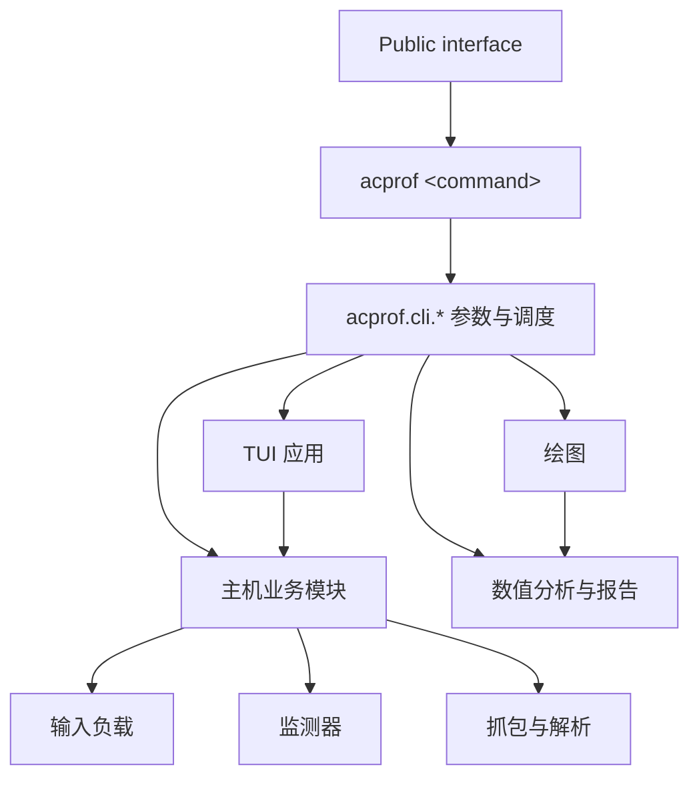

# 目录职责与依赖边界

[← 返回专题目录](architecture.md)

## Python 文件规模与拆分原则

`acprof/` 内的 Python 源码以 **500 物理行为软目标**、**800 行为审查阈值**（严格大于阈值才标记）。
**没有硬性行数上限**：CI 报告规模，不因超限而失败，也不应为了行数机械拆分模块。
测量窗口、结果字段、resume 行为和实验 provenance 优先于缩短文件。

从仓库根目录运行 `python scripts/check_module_sizes.py`，可用 `--top 0` 列出全部需关注文件，
或 `--json` 导出所有模块的机器可读结果。它只扫描 `acprof/`，包含注释、空行和大字典等
**物理行数**。报告还列出最长函数长度、函数内静态决策节点数量、长函数数量、类数量及静态
项目内部 import 数量，均为**人工审查线索**，不等同于圈复杂度、实际运行时依赖或测试覆盖率。
纯字典／列表声明超过 60% 的大型翻译或静态数据文件会标注 `data-review`，继续展示但降低拆分优先级。

审查超过 800 行的模块时，依次确认：

1. **职责**：能否把独立的数据处理、配置、展示或副作用从控制器分离，而不增加相互调用。
2. **函数复杂度**：检查长函数的分支、异常、状态转换；优先拆出可独立验证的函数。
3. **模块耦合**：结合 `scripts/check_import_boundaries.py`、`scripts/check_private_api.py` 与真实调用关系核对，
   不能把 import 数量直接当成依赖风险。
4. **测试难度**：有无覆盖正常、异常与恢复路径的 pytest；提取模块前后测试必须保持可观察行为。

按单一职责分批重构，而不是一次性把所有文件降至 500 行以下。新增审查提示不代表已有模块不合格；
优先处理职责混杂且修改频繁、测试困难的模块，低耦合的数据目录可保持原结构。
详细使用和 CI 范围见[开发质量检查](quality.md#开发质量检查)。

该审查方式参考 [Pylint 的 `too-many-lines` 检查](https://github.com/pylint-dev/pylint/blob/main/pylint/checkers/format.py)
和 [Radon 的复杂度指标](https://github.com/rubik/radon)；AC-Prof 不额外引入依赖，
只借鉴“可检查的提示指标，不替代人工架构判断”的思路。

## 目录与职责

| 位置 | 职责 |
| --- | --- |
| `acprof/cli/` | 命令参数、入口调度和退出处理 |
| `acprof/tui/` | Textual 页面、事件、命令构造、进度、设置和日志控件 |
| `acprof/analysis/` | 延迟模型的数值计算、验证与报告文件 |
| `acprof/plotting/` | 当前 CSV 校验、图表配置、颜色与渲染 |
| `acprof/host/` | 模型检测、环境预检、输入计划、容器与采集编排、profiler |
| `acprof/host/posthoc/` | 已有结果的 profiler 补采、回填、备份与回滚 |
| `acprof/container/` | 容器内模型下载、HTTP server、推理处理器和 profiler runner |
| `acprof/workloads/` | 各任务族的确定性输入与素材准备 |
| `acprof/monitors/` | 能耗、资源与 PMU 的原始测量 |
| `acprof/packet/` | 抓包解析及 packet latency 合并 |
| `acprof/config.py` | 共享配置、任务尺度及 CSV/静态元数据字段协议 |
| `acprof/artifacts.py`、`acprof/result_csv.py` | 原子产物发布、CSV 结构与测量唯一键校验；不初始化采集依赖 |
| `acprof/artifact_layout.py` | 结果清单、v2/flat 布局识别、受限相对路径及 case sidecar 路由；采集、恢复、补采和分析共用 |
| `acprof/pixel_metrics.py` | 像素计数和能耗/延迟归一化的纯计算，由 client、packet 和 plotting 共用 |
| `acprof/runtime_profiles.py` | 平台、依赖环境、逻辑 profile 与锁身份；从扩展声明读取路由 |
| `acprof/model_resolution.py`、`acprof/model_spec.py` | 静态接口候选、schema 校验与执行契约；本地／作者声明优先于自动生成 |
| `acprof/model_evidence.py`、`acprof/model_metadata_analysis.py`、`acprof/model_source_analysis.py`、`acprof/model_contract.py` | 固定 snapshot 的来源记录、结构化元数据、受限 AST 与 Pipeline 契约生成；仅在主机准备阶段分析文本，细节见[自动生成模型契约](../models/contracts.md#自动生成模型契约m1m6) |
| `acprof/model_dependencies.py`、`acprof/model_review.py`、`acprof/model_transforms.py` | 按 loader 角色固定依赖与文件选择、未决字段的显式决策、有界 JSON 输入转换；下载复用既有镜像 planner |
| `acprof/host/source_bundle.py`、`acprof/host/interface_probe.py`、`acprof/container/model_probe.py` | 固定源码图、无权重的隔离 import／signature 检查，独立接口报告 |
| `acprof/host/model_inspection.py`、`acprof/tui/preparation.py` | 静态解释、统一模型确认与准备弹窗；完整 Smoke 复用 `runtime_validation` |
| `acprof/host/automation.py`、`acprof/host/model_coverage.py` | 精确模型的访问／能力预检、自动运行报告，以及固定样本的解析／运行覆盖率；`cli/auto.py` 委派现有 run 入口，不复制测量循环 |
| `acprof/extensions/` | schema v2 类型校验与 `ExtensionCatalog.resolve`；集中维护路由、尺度、IO、精度、输入规划能力及环境声明 |
| `acprof/capabilities.py` | execution / measurement 状态、验证证据和画像完整性报告 |
| `acprof/container/validation.py`、`acprof/workloads/contract.py` | 窗口外输出验证与实际请求工作量摘要 |

下载准备由 `network_policy.py`、`hf_transport.py`、`host/network_preflight.py` 与 `host/model_store.py` 分工：来源/预算、Hub 请求约束、总量/磁盘预检、单份权重与只读挂载。`runtime_images.py` 先核验计划和预算，再准备依赖、Model Store 与只含清单的模型层；细节见[下载网络与 Model Store](../models/model-store.md#下载网络与-model-store)。

## 入口与依赖方向

实现层不导入 `acprof.cli`。数值分析层不依赖绘图库；命令和配置模块不通过包初始化
提前加载 Textual。容器内推理与主机通过现有 HTTP、输入计划和产物协议交互。
`scripts/check_import_boundaries.py` 在 CI 中用 AST 检查各关键包的运行时导入方向，
不允许分析、容器与负载层倒向采集或 UI 层。`TYPE_CHECKING` 导入不形成运行时耦合；
monitor 使用共享 `host.command` 的两条现有边精确豁免，待命令归属迁移时再删除。

跨模块调用应引用职责所属模块的公共能力。`scripts/check_private_api.py` 用标准库 AST
记录 `acprof/` 中的 `(source, target, symbol)`，CI 拒绝未登记的新 private dependency，
也拒绝已经失效但仍留在 baseline 中的条目；具体范围与维护命令见
[private API 检查](static-checks.md#跨模块-private-api-检查)。
`client_metrics` 与 client/diagnostics、`resource_metrics` 与资源采样器属于现有内部协作边界，
继续逐条登记，不给予整个子系统无限制豁免。`latency_model` 的 analysis/plotting 边界同样保留
现有条目，后续按职责处理，不以消除下划线数量为目标。

用户统一使用 `acprof <command>`，TUI 的正式入口为 `acprof tui`，由 `acprof.cli.main:main` 分发。
`acprof.cli.tui` 是 TUI 命令的内部实现模块。根目录不包含 Python 文件；
构建 hook 只存在于 `packaging/hatch_build.py`，开发工具位于 `scripts/`。
`profile` 和 `cProfile` 直接使用 Python 标准库。
TUI 预览、terminal log 和新 metadata 的命令统一展示为可复制的 `acprof <command>`；
子进程内部通过 `installation.cli_command()` 选择当前 Python 或 standalone 可执行文件。
`acprof.host.client`、容器 server/runner 和 packet 命令的模块路径保持原样。

产物路径由 `ArtifactLayout` 根据 `result_manifest.json` 统一路由。新主实验显式初始化 v2，
无清单目录按 flat layout 只读发现；未知清单和越界路径报错。`CaseArtifacts` 统一管理 case
CSV、请求样本、PCAP 和诊断路径，client 与 packet merge 的 sidecar 路由仅做路径计算。
manifest 不维护实时文件清单，避免在测量窗口扫描或计算 hash；恢复校验仍由 `run_state` 负责。
格式与旧目录边界见[Artifact Layout v2](../profiling/artifacts.md#artifact-layout-v2)。

此设计参考 [Hydra 的输出分层](https://github.com/hydra-ecosystem/hydra/blob/main/hydra/core/utils.py)
和 [pytest 的内部目录](https://github.com/pytest-dev/pytest/blob/main/src/_pytest/cacheprovider.py)。
两者均采用 MIT 许可，提供成熟源码可供核对；本项目借鉴分层和受限路径的思想，
使用标准库及已有原子发布代码，没有引入框架依赖或复制其实现。
AC-Prof 的内部目录含恢复依据，不沿用 pytest 的可丢弃缓存语义或 `CACHEDIR.TAG`。

## 只保留当前协议

已有明确替代实现的兼容代码直接删除；旧参数、旧 schema 或未登记的运行环境在入口报错。
当前设置文件要求 version 4，输入计划要求 schema v2，静态元数据要求 schema v7，
抓包记录要求 schema v2 的 `requests` 对象，历史记录单独保存在 schema v1 的 `collection_history.json`。
不读取 `static_meta.csv`，不迁移嵌入静态元数据的 history/last-run，不转换旧 GPU/通用 FLOP 列。

采集只支持 cgroup v2 和锁定依赖的镜像；CPU/GPU 使用匹配 monitor 的对照窗口作为能耗基线。
Massif/Nsys 使用原模型镜像预装的运行库，缺少能力标记时要求重建，不派生兼容镜像。
未知 backend、丢失的显式本地快照和无法查询的 NCU counters 都明确报错。
驱动分支和任务专用 handler 具有独立用途，继续保留。

### 可靠性设计参考

子进程采用 Python 3.10+ 标准库（PSF License），遵循 [CPython 等待/超时语义](https://github.com/python/cpython/blob/3.10/Lib/subprocess.py)；
硬件观测借鉴 [pyperf 元数据采集](https://github.com/psf/pyperf/blob/main/pyperf/_collect_metadata.py)（MIT），
不引入 benchmark 调度依赖。Requests（Apache-2.0）的超时边界依据 [overall timeout Issue](https://github.com/psf/requests/issues/3099)，
保留既有 Requests 和串行短连接协议。视觉回归复用 [Textual 官方插件](https://github.com/Textualize/pytest-textual-snapshot)（MIT），
依赖与运行入口统一见[辅助开发工具](devtools.md#辅助开发工具)；不将其依赖或事件轮询带入测量窗口。
依赖升级通过锁文件和独立回归验收；硬件查询仅在 case 开始边界执行，不增加窗口内采样器。
这些改动复用当前架构中的 `MonitorGroup`、artifact layout 与 evidence runner，不复制第三方框架。
