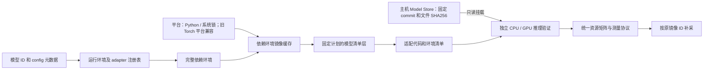

# 模型运行环境与适配器

AC-Prof 按模型选择逻辑 profile 和 adapter，profile 引用完整依赖环境，Docker 镜像缓存该环境的构建结果。
7 个任务族负责输入、调用和输出协议；平台负责 Python、OS/架构和系统依赖。
运行时由依赖环境声明；旧 Torch/CUDA 平台继续复用，`python-cpu` 平台不要求 Torch。主机只负责检测、规划和测量。
各专题命令均从仓库根目录执行；示例资源配置不表示当前机器可用容量。

新增模型适配或调整镜像依赖时按下列专题查阅。任务支持范围由[本文的任务目录](supported-tasks.md#任务支持范围)维护，
环境元数据的字段定义见 [采集协议](../profiling/metadata.md#static_metajson-字段)，模块依赖见[代码架构](../development/orchestration.md#主机编排与测量)。

## 专题索引

- [运行环境与配置](environment.md)：基础环境、Python/系统依赖及版本配置。
- [接口解析与 Runtime 预检](routing.md)：共享接口识别、证据裁决和运行预检。
- [自动生成模型契约](contracts.md)：M1～M6 模型契约生成规则。
- [动态模块与自定义 Pipeline](pipelines.md)：dynamic-module 生命周期、模型声明和自定义处理。
- [扩展与执行约定](extensions.md)：扩展 manifest、动态加载和 MOSS 执行约定。
- [镜像构建与管理](images.md)：构建复用、镜像分类、查询、清理与空间。
- [模型制品与适配](adaptation.md)：文件选择、增加模型适配和参考实现。
- [任务接口与支持范围](supported-tasks.md)：NLP、语音、视觉和多模态任务接口。
- [下载网络与 Model Store](model-store.md)：Hub 下载路径、制品来源和本地缓存。
